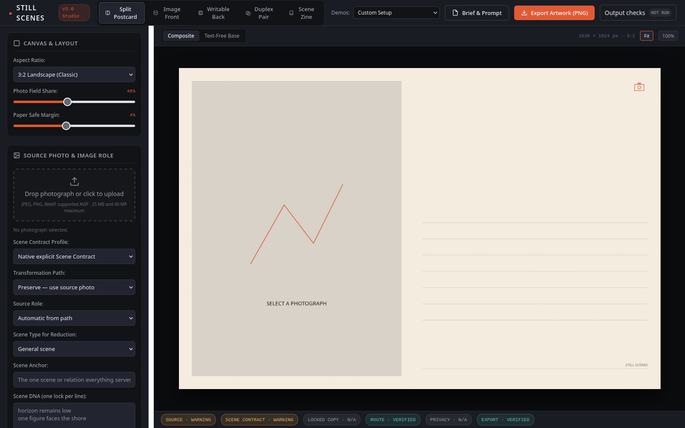
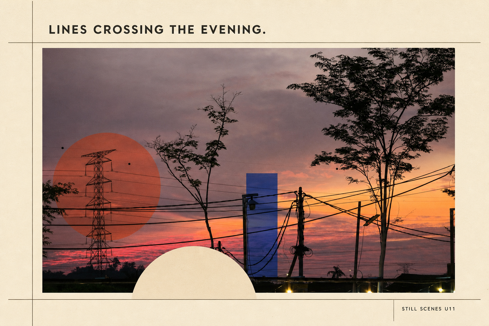
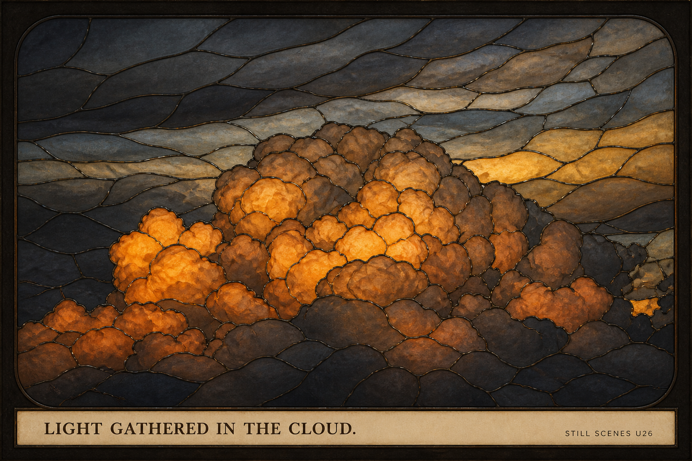
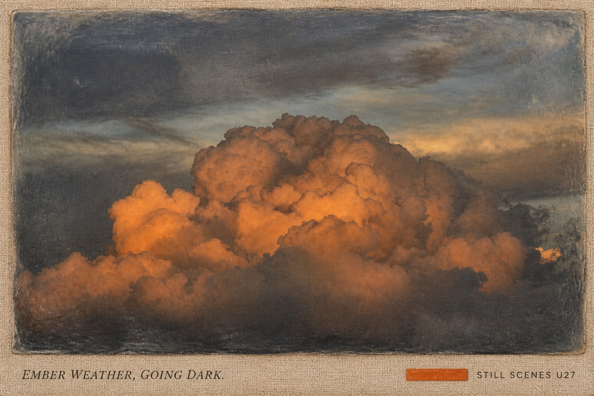
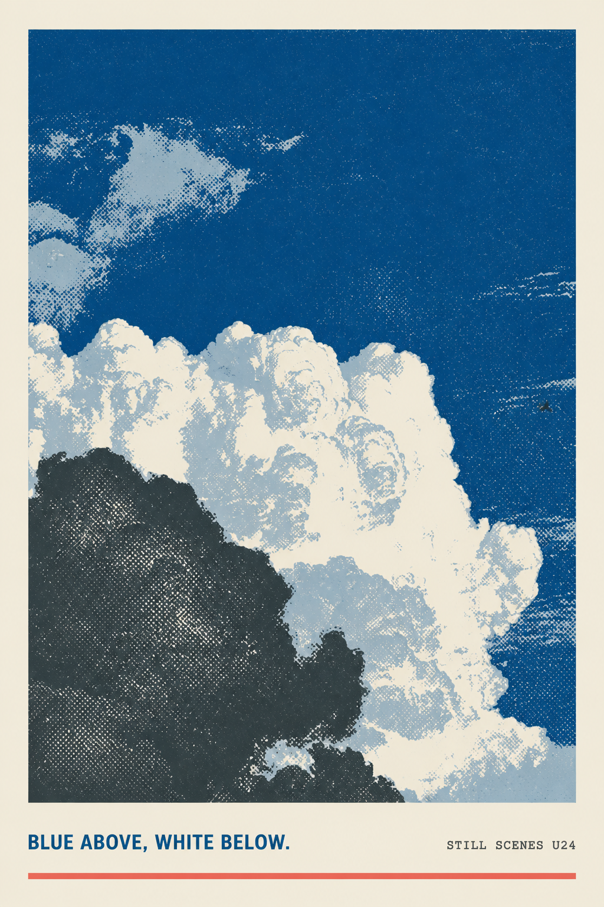
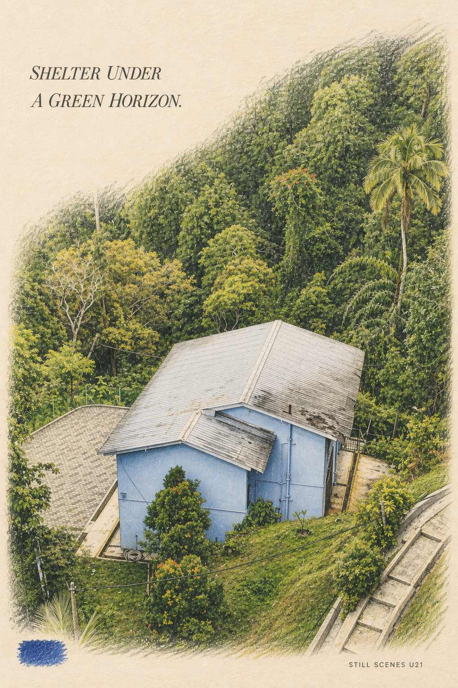
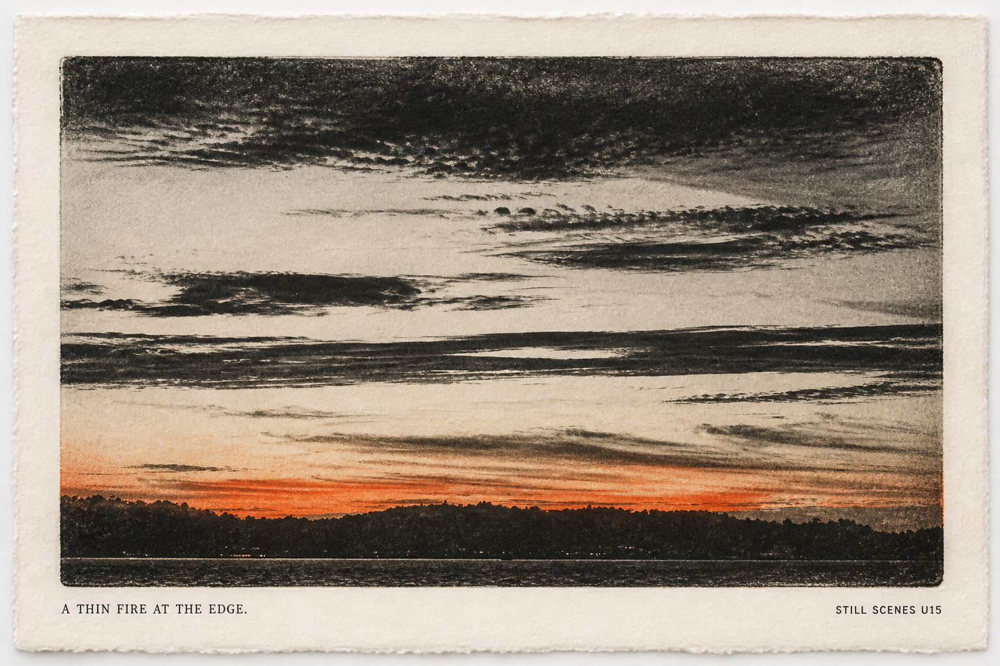

# Still Scenes

[Try Still Scenes Studio live on GitHub Pages](https://noteheng.github.io/still-scenes/) — the default composer remains local-first, dependency-free, and telemetry-free.

*The local-first Studio: route-aware composition, Scene Contract controls, deterministic canvas preview, export, and returned-image checks. Select the screenshot to open the live demo.*

Still Scenes is a scene-preservation and visual-memory system built around one rule: the author's selected picture and exact words remain authoritative.

> Still Scenes understands what makes a scene yours, controls what may change, and records what actually changed.

The repository contains two related products:

1. A dependency-free browser studio that composes uploaded photographs into Still Scenes layouts.
2. A reusable Still Scenes skill for planning, transforming, reviewing, and documenting personal photographic artwork.

| Source photograph | Scene Contract summary | Final Still Scenes output |
|---|---|---|
|  | **U11** · Anchor: wire-crossed urban dusk. Geometry: wires, tower, lamps, poles, and tree silhouettes retained. Palette: coral, rust, cobalt, cream. |  *LINES CROSSING THE EVENING.* |
|  | **U18** · Anchor: layered hillside garden. Spatial locks: left tree, conifers, paths, fences, and hillside depth. Palette: moss, pine, sky blue, flax. |  *THE HILLSIDE WOVE ITSELF.* |
|  | **U26** · Anchor: central orange-lit cloud. Geometry: cloud silhouette, surrounding strata, and low shadowed base retained. Palette: amber, burnt orange, smoke, charcoal, cream. |  *LIGHT GATHERED IN THE CLOUD.* |

All three source photographs were taken by Bryan, the repository owner and author. Their exact production prompts remain in the documented U-series galleries below.

## What is included

- Six workflow routes spanning artwork creation, prompt-only work, reference analysis, analyze-and-create, and batch sets.
- Five surfaces: image front, writable back, split card, duplex pair, and editorial page.
- Explicit source roles: scene anchor, scene evidence, reference grammar, supporting fragment, generated scene, or no source.
- A compact Scene Graph for anchors, relations, direction, depth, quiet fields, focal hierarchy, density, and declared source evidence.
- A first-party Scene Contract with identity, geometry, spatial, palette, count, text, source-role, and privacy locks.
- A per-dimension Mutation Budget whose permissions are always subordinate to Scene Contract locks.
- Constraint-based layout and material logic driven by the actual scene rather than a fixed whitespace template.
- Explainable art-direction records and Scene Deltas covering retained, simplified, transformed, removed, added, unexpected, and independently verified lock families.
- Preserve, reduce, hybrid, and source-free distill transformation paths; high, medium, and low remain compatibility aliases.
- Locked caption, message, location, and date handling.
- Caption assistance, alt text, production records, and reusable generation prompts.
- Source-safe batch variation and privacy rules that never infer a printable location from photo metadata.
- A static ES-module Canvas studio with bounded local image upload, deterministic texture, exact-copy fitting, and blob-based client-side export.
- Heuristic returned-image verification for palette distance, 64-bit perceptual structure, and declared surface geometry.
- An optional, separately disclosed bring-your-own-endpoint gateway; it is disabled by default and never weakens the core page's `connect-src 'none'` policy.
- Portable PNG/PDF provenance, a matching JSON sidecar, and a local PNG provenance reader.
- 34 distinct rendered Still Scenes artworks: seven original generated scenes and 27 source-preserving transformations.
- Three transformations for each of the nine photographs taken by the owner and author, with exact prompts and SHA-256 provenance.
- Fifty-three canonical evaluation scenarios covering V3 scene intelligence, sequences, collections, similarity, provenance, hostile uploads, Unicode copy, capabilities, and failure reporting, plus a smaller legacy compatibility suite.

## Scene Intelligence V3

The browser Studio and portable Skill now share one governed planning flow:

~~~text
source declaration
  → Scene Graph
  → Scene Contract
  → Mutation Budget
  → source boundary
  → layout plan + material logic
  → expected Scene Delta
  → Prompt Compiler V3 / deterministic render
  → returned-image verification
  → observed Scene Delta
~~~

The new `scene-evidence` role is distinct from style reference grammar. It lets a personal photograph provide Scene DNA, palette, gesture, depth, relation, and emotional temperature for Distill while explicitly prohibiting recognizable source raster in the result.

Distill uses a bounded six-stage plan—observation, residue, relation, optional declared tension, paper-native form, and opening. The Studio never invents a tension merely to make the artwork sound profound; absent user evidence, that stage stays empty and disclosed.

Memory Sequence planning assigns narrative roles and pace across mixed photo, generated, and text-only inputs while preserving user order by default. Collection DNA creates current-request family resemblance without pretending to remember an unrelated session. The similarity guard requires at least three meaningful recipe-axis changes when adjacent outputs become too alike.

## Quick start: browser studio

No package installation or build step is required.

~~~bash
cd /path/to/still-scenes
python3 -m http.server 8000
~~~

Open `http://localhost:8000/`.

Serving the directory over HTTP is preferable to opening `index.html` directly because browser file-origin restrictions can affect preset images and clipboard access.

### Browser-studio features

- Split postcard, image front, writable back, real two-surface duplex, and scene-zine routes.
- 3:2, 2:3, 4:5, 3:5, and A6 landscape output ratios.
- Click-to-upload and keyboard/drag-and-drop local images with MIME, file-size, signature, decoded-dimension, and pixel-count validation.
- Live location, date, caption, writing-rule, paper, accent, typography, postal-mark, and texture controls.
- Route-compatible composite, text-free, front, and back views.
- Safe JSON brief, route-aware Prompt Compiler V3, explainable art-direction/Scene Delta inspector, and route-aware accessibility alt text.
- Client-side RGB PNG export via `canvas.toBlob()`; duplex exports separate matching front and back files.
- Additional dependency-free RGB PDF export with configurable bleed (3 mm default), trim/bleed boxes, embedded provenance, and an explicit no-CMYK/no-certification limitation.
- Embedded PNG provenance plus a matching human-readable JSON sidecar and copyable record.
- A returned-image verification panel that reports palette distance, perceptual-hash Hamming distance, aspect-ratio agreement, and numeric confidence.
- Five observable source treatments, six paper families, purpose-labelled accents, and stable seeded texture with deliberate regeneration.
- Fit and 100% zoom, keyboard navigation, modal focus management, visible focus, live status announcements, and narrow-screen layouts.
- All 34 documented artworks are available as built-in presets; the 27 U-series entries use their existing manifest metadata.
- Optional in-browser generation through a generic JSON or OpenAI Images-compatible endpoint adapter, enabled only after the user supplies an endpoint and explicitly consents to the disclosed transfer.

The default browser path is a deterministic layout composer and prompt workbench and performs no network generation. Users may separately opt into the bring-your-own-endpoint gateway. That action sends the compiled prompt, API key, model/size request, and—when the route requires it—the selected source image to the endpoint the user entered. See [`PRIVACY.md`](PRIVACY.md) before enabling it.

## Use the Still Scenes skill

The canonical portable skill is [`skills/still-scenes-postcard/`](skills/still-scenes-postcard/). The original [`skills/still-scenes-postcard-zine/`](skills/still-scenes-postcard-zine/) package remains intact as a compatibility package so existing installations and exact historical prompt records continue to work.

Copy that directory into a new, non-conflicting directory under your Codex skills location, then invoke:

~~~text
$still-scenes-postcard
~~~

Legacy invocation remains supported as `$still-scenes-postcard-zine`.

Example request:

~~~text
Use the Still Scenes skill to transform my photograph or scene idea into a personal artwork with a custom caption.
~~~

The skill returns the artifact or output path, final prompt, route and surface recipe, source role, Scene Graph, Scene Contract, Mutation Budget, layout and material decisions, Scene Delta, locked-copy record, accessibility alt text, capability record, and any retry or limitation note.

## Author-photo collection: three transformations per source

| Source | Style 1 | Style 2 | Style 3 |
|---|---|---|---|
| Urban sunset and wires | U01 split card | U10 newsprint | U11 geometric collage |
| Sea sunset | U02 full bleed | U12 watercolor | U13 darkroom contact print |
| Banded sunset | U03 triptych | U14 accordion strips | U15 monoprint |
| Crescent moon | U04 risograph | U16 silver gelatin | U17 celestial field note |
| Hillside garden | U05 botanical field note | U18 woven jacquard | U19 map fold |
| Blue hillside house | U06 paper collage | U20 blueprint | U21 colored pencil |
| White cloud tower | U07 Swiss editorial | U22 lithograph | U23 paper relief |
| Cloud and one bird | U08 cyanotype | U24 screenprint | U25 dry pastel |
| Orange-lit cloud | U09 vintage duotone | U26 stained glass | U27 encaustic transfer |

### Photographs by the author

All nine source photographs in this collection were taken by me, Bryan, the repository owner and author. I transformed my original photographs with the Still Scenes skill to create the U01–U27 artworks. These are transformations of owner-authored photography, not stock-photo or third-party image inputs.

The following four works are featured examples from that collection:

| U27 — Encaustic cloud transfer | U24 — Four-ink cloud screenprint |
|---|---|
|  |  |
| *EMBER WEATHER, GOING DARK.* — [exact production prompt](demos/USER_PHOTO_STYLE_DEMOS_EXPANSION.md#L398) | *BLUE ABOVE, WHITE BELOW.* — [exact production prompt](demos/USER_PHOTO_STYLE_DEMOS_EXPANSION.md#L331) |
| U21 — Colored-pencil house | U15 — Evening monoprint |
|  |  |
| *SHELTER UNDER A GREEN HORIZON.* — [exact production prompt](demos/USER_PHOTO_STYLE_DEMOS_EXPANSION.md#L265) | *A THIN FIRE AT THE EDGE.* — [exact production prompt](demos/USER_PHOTO_STYLE_DEMOS_EXPANSION.md#L133) |

The complete, source-mapped prompt galleries are:

- [`demos/USER_PHOTO_STYLE_DEMOS.md`](demos/USER_PHOTO_STYLE_DEMOS.md) — U01–U09.
- [`demos/USER_PHOTO_STYLE_DEMOS_EXPANSION.md`](demos/USER_PHOTO_STYLE_DEMOS_EXPANSION.md) — U10–U27.
- [`demos/user-photo-styles/MANIFEST.csv`](demos/user-photo-styles/MANIFEST.csv) — source files, review references, output files, dimensions, styles, captions, and SHA-256 hashes.

## Representative Still Scenes transformations and exact prompts

The following images are included directly in this README. Each prompt is the exact prompt used for the displayed output.

The historical phrase `Still Scenes Postcard Zine skill` is preserved inside these prompt records because changing logged prompt text would break their exact provenance. The public-facing project and skill name is **Still Scenes**.

### U11 — Geometric urban sunset

Exact U11 prompt

~~~text
Use case: image editing / geometric modernist collage
Asset type: user-photo demo U11 for the Still Scenes Postcard Zine skill
Primary request: Recompose the supplied urban sunset as a landscape 3:2 geometric photo-collage postcard, keeping its infrastructure and dusk unmistakably recognizable.
Reference handling: Use only the supplied photo. Preserve the main tree silhouettes, power tower, lamps, poles, wires, and saturated sunset strip. Do not erase or redraw the wires; let their real diagonals organize the composition.
Composition: Flat cream paper. Place the full photograph in a wide central rectangle occupying 74% of the card. Overlay only three simple translucent shapes—a rust circle behind the tower, a narrow cobalt rectangle near one lamp, and a cream semicircle at the lower edge—without covering the defining scene. Add two hairline grid rules and generous margins.
Style/medium: 1920s-inspired geometric editorial design interpreted as contemporary matte photo collage, crisp shapes, subtle paper grain, no historical logos.
Text (verbatim): "LINES CROSSING THE EVENING."; "STILL SCENES U11".
Typography: First sentence exactly once in dark charcoal uppercase geometric sans along the upper-left margin. Second exactly once in tiny uppercase sans at lower right. No other readable text.
Color palette: cream, charcoal, source coral-pink, rust, cobalt blue.
Mood: rhythmic, graphic, still recognizably documentary.
Constraints: source scene and wire network remain identifiable; exact text; no people, vehicles, logos, URL, date, location, watermark, or postal marks.
Avoid: abstracting away the photograph, extra geometric clutter, constructivist propaganda, glossy mockup, 3D shadow, neon, extra words, misspellings.
~~~

### U18 — Woven hillside garden

Exact U18 prompt

~~~text
Use case: image editing / woven textile interpretation
Asset type: user-photo demo U18 for the Still Scenes Postcard Zine skill
Primary request: Transform the supplied hillside garden photograph into a landscape 3:2 woven-textile scene postcard while retaining the real landscape structure.
Reference handling: Use the supplied image as the sole scene source. Preserve the large shaded tree at left, tall narrow conifers, blue sky and clouds, layered hillside, paths and fences, architecture glimpses, and small red foliage accents. Do not replace the garden with a generic forest.
Composition: Flat warm flax-paper card. A large rectangular woven image occupies 84% of the surface with a narrow cream selvedge. Use a simple caption strip underneath and one short red stitched bar; no decorative border pattern.
Style/medium: Fine jacquard tapestry translated from photography, visible interlaced threads, controlled tonal weaving, matte natural fibers, contemporary textile sample.
Text (verbatim): "THE HILLSIDE WOVE ITSELF."; "STILL SCENES U18".
Typography: First sentence exactly once in dark forest-green uppercase serif at bottom left. Second exactly once in tiny uppercase sans at bottom right. No other text.
Color palette: moss, pine, fern, sky blue, flax, small woven red accents.
Mood: dense, tactile, sheltered.
Constraints: source depth, trees, structures, and color anchors remain recognizable; exact text; no people, fantasy animals, logo, URL, date, location, watermark, or postal marks.
Avoid: decorative folk motifs, carpet border, generic jungle, resort imagery, glossy mockup, 3D folded fabric, extra words, misspellings.
~~~

### U26 — Stained-glass cloud

Exact U26 prompt

~~~text
Use case: image editing / stained-glass interpretation
Asset type: user-photo demo U26 for the Still Scenes Postcard Zine skill
Primary request: Transform the supplied orange-lit cloud photograph into a landscape 3:2 stained-glass scene postcard while preserving the real cloud mass.
Reference handling: Use only the supplied photo. Preserve the central billowing cloud glowing orange, darker surrounding cloud layers, low shadowed base, and source framing. Translate actual tonal boundaries into glass pieces without adding sun, landscape, figures, or symbols.
Composition: Flat front-facing warm-charcoal card. A broad rounded-rectangle glass panel fills 86% of the surface. Use fine dark lead lines that follow major cloud lobes and surrounding strata, with a narrow cream caption strip below.
Style/medium: Hand-cut translucent stained glass photographed straight-on, subtle material glow, fine leadwork, contemporary secular art panel.
Text (verbatim): "LIGHT GATHERED IN THE CLOUD."; "STILL SCENES U26".
Typography: First sentence exactly once in dark umber uppercase serif at lower left. Second exactly once in tiny uppercase sans at lower right. No other text.
Color palette: amber, burnt orange, smoke gray, charcoal, muted cream.
Mood: luminous, weighty, reverent without religious symbolism.
Constraints: recognizable source cloud silhouette and lighting; exact readable text; no crosses, religious icons, flames, explosions, people, logo, URL, date, location, watermark, or postal marks.
Avoid: church window motifs, kaleidoscope clutter, literal fire, disaster imagery, glossy product mockup, 3D room scene, extra words, misspellings.
~~~

## Demo documentation

- [`demos/DEMO.md`](demos/DEMO.md) — three foundational generated routes.
- [`demos/EXTRA_DEMOS.md`](demos/EXTRA_DEMOS.md) — four additional generated scenes and surfaces.
- [`demos/USER_PHOTO_STYLE_DEMOS.md`](demos/USER_PHOTO_STYLE_DEMOS.md) — first source-preserving treatment for each supplied photo.
- [`demos/USER_PHOTO_STYLE_DEMOS_EXPANSION.md`](demos/USER_PHOTO_STYLE_DEMOS_EXPANSION.md) — second and third treatments for each supplied photo.

## Repository structure

~~~text
.
├── README.md
├── DESIGN.md
├── ARCHITECTURE.md
├── PRIVACY.md
├── PROVENANCE.md
├── TESTING.md
├── CHANGELOG.md
├── network.html                       # explicit opt-in network gateway
├── provenance.html                    # local read-only PNG metadata reader
├── index.html
├── app.js                              # preserved V1 reference; not loaded
├── styles.css
├── package.json                        # test metadata; no runtime dependencies
├── src/                                # shipped browser-native ES modules
│   ├── main.js
│   ├── state.js
│   ├── scene-contract.js
│   ├── image-loader.js
│   ├── typography.js
│   ├── prompt-compiler.js
│   ├── quality.js
│   ├── export.js
│   ├── export-print.js
│   ├── provenance.js
│   ├── provenance-reader.js
│   ├── verify.js
│   ├── generate.js
│   ├── adapters/
│   └── render/
├── tests/                              # Node built-in behavior tests
├── demos/
│   ├── DEMO.md
│   ├── EXTRA_DEMOS.md
│   ├── USER_PHOTO_STYLE_DEMOS.md
│   ├── USER_PHOTO_STYLE_DEMOS_EXPANSION.md
│   ├── generated/                         # 7 original generated demos
│   └── user-photo-styles/
│       ├── source-photos/                 # 9 preserved camera originals
│       ├── review-previews/               # 9 reduced inspection references
│       ├── generated/                     # U01–U27
│       └── MANIFEST.csv
├── skills/still-scenes-postcard/          # canonical portable skill package
│   ├── SKILL.md
│   ├── agents/openai.yaml
│   ├── evals/evals.json
│   ├── references/
│   └── assets/
│       ├── demos/                          # mirrored 7 generated demos
│       └── user-photo-demos/               # mirrored U01–U27
└── skills/still-scenes-postcard-zine/     # preserved legacy package
    ├── SKILL.md
    ├── agents/openai.yaml
    ├── evals/evals.json
    ├── references/
    │   ├── scene-contract.md
    │   ├── capability-matrix.md
    │   ├── style-system.md
    │   ├── postcard-system.md
    │   ├── prompt-library.md
    │   └── quality-gates.md
    └── assets/
        ├── demos/                          # mirrored 7 generated demos
        └── user-photo-demos/               # mirrored U01–U27
~~~

## Source handling and privacy

- All nine full-resolution source photographs were taken by Bryan, the repository owner and author, and remain unchanged in `demos/user-photo-styles/source-photos/`.
- Reduced review copies were used as image-generation references because the camera-sized JPEGs exceeded the image service input limit.
- The manifest records source and output hashes for integrity checks.
- One source JPEG reports recoverable decoder marker warnings but remains readable and passes ZIP integrity testing; it was not rewritten.
- No EXIF GPS fields were detected during inspection. The original photographs and timestamp-based filenames may still reveal personal context if this repository is published.
- Do not infer or print a private location from metadata. Only use a location explicitly supplied or approved by the user.
- The Studio accepts only bounded JPEG, PNG, WebP, and supported AVIF inputs; checks declared MIME against file signatures; validates decoded dimensions; and releases replaced image resources.
- User-upload mode carries explicit provenance. Untouched preset location, date, caption, description, and preset ID are cleared when a custom upload succeeds; manually authored copy is preserved.
- The core page has no analytics, trackers, remote fonts, remote images, remote APIs, or telemetry. Its Content Security Policy remains `connect-src 'none'`.
- Uploaded images remain in the current browser session and are never persisted by the Studio. Only an explicit generation action in the separately opened gateway can transmit the disclosed prompt, key, and optional source image to the user-entered endpoint.
- Exported PNG/PDF files and JSON sidecars carry a deliberately limited provenance record; they do not contain raw uploaded image bytes, a full compiled prompt, EXIF, or inferred location. See [`PROVENANCE.md`](PROVENANCE.md) and [`PRIVACY.md`](PRIVACY.md).

## Validation

Skill metadata:

~~~bash
python3 -B /path/to/skill-creator/scripts/quick_validate.py skills/still-scenes-postcard
~~~

Automated behavior, privacy, upload, Unicode, routing, quality, and compiler tests:

~~~bash
npm test
~~~

The package has no dependencies; `npm test` invokes Node's built-in test runner.

Shipped module syntax:

~~~bash
node --check src/main.js
~~~

Evaluation JSON:

~~~bash
python3 -c 'import json; json.load(open("skills/still-scenes-postcard/evals/evals.json", encoding="utf-8")); print("evals: valid JSON")'
~~~

Image inspection:

~~~bash
identify demos/generated/*.png demos/user-photo-styles/generated/*.png
~~~

The completed workspace validation also compares every gallery image with its mirrored skill asset, checks all image dimensions, and rejects empty files or unexpected symlinks.

## Known browser-studio limitations

- The verifier is intentionally heuristic. Palette distance, a 64-bit dHash, and aspect-ratio checks can flag conspicuous divergence, but they cannot prove identity, object geometry, count, OCR accuracy, semantic fidelity, source-boundary compliance, or every Scene Contract lock. Those families remain `declared` or `not-applicable` until capable inspection exists.
- The browser Scene Graph is built from user/preset declarations and bounded file facts; it does not claim semantic computer vision. Its art-direction record explains external inputs and decisions, not hidden chain-of-thought.
- Memory Sequence, Collection DNA, and similarity planning are deterministic current-request modules. The Studio does not persist collections or claim cross-session memory.
- Optional generation depends on the endpoint's API, CORS policy, availability, output schema, and retention terms. API keys remain in page memory only; HTTPS-hosted Studio pages cannot call insecure HTTP endpoints because browsers block mixed content.
- Browser Distill is an honest source-free procedural interpretation based on declared Scene DNA and sampled palette evidence, not full semantic image-model distillation.
- Quality gates verify deterministic properties such as route compatibility, provenance ownership, exact source strings, measured fit, pixel dimensions, and source-free procedural rendering. Returned-image verification provides evidence, not semantic proof; identity and fidelity claims still require human or capable-model inspection.
- Uploaded images are session-only and are not restored after refresh.
- AVIF is accepted only when the current browser can decode it.
- PNG and PDF exports remain RGB. The PDF packages a raster page with configurable bleed and trim metadata, but performs no CMYK conversion, ICC proofing, printer proof, or press certification.
- Embedded provenance is self-asserted local metadata, not a signature, external timestamp, or tamper-proof certificate.
- `app.js` is retained as a historical V1 reference under the repository's no-deletion policy; `index.html` ships only `src/main.js` and its module dependency graph.

See [`ARCHITECTURE.md`](ARCHITECTURE.md), [`PRIVACY.md`](PRIVACY.md), [`PROVENANCE.md`](PROVENANCE.md), and [`TESTING.md`](TESTING.md) for the implementation boundaries and verification commands.

## Design references and originality

The design study refers to:

- [Gathered Scenes Zine Skill](https://github.com/Zeejay0/gathered-scenes-zine-skill)
- [GC Minimal Zine Poster](https://github.com/LiamGvchi/gc-minimal-zine-poster)

Still Scenes is independently written. It does not copy upstream assets, branding, source wording, or exact compositions, and it is not affiliated with or endorsed by either upstream project. Links in the demo research notes are visual-research cues only; the rendered demo assets are generated originals or transformations of photographs taken by the repository owner and author.

## License

Still Scenes is provided under the [MIT License](LICENSE). The source-photograph authorship and transformation provenance are documented above and in the source-mapped manifests.
