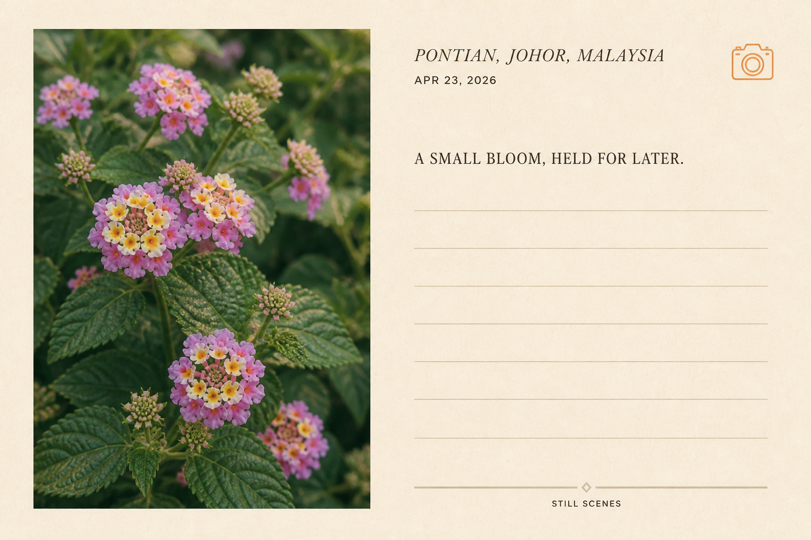
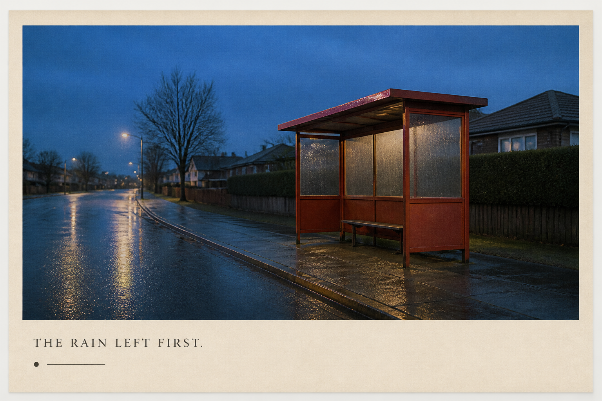
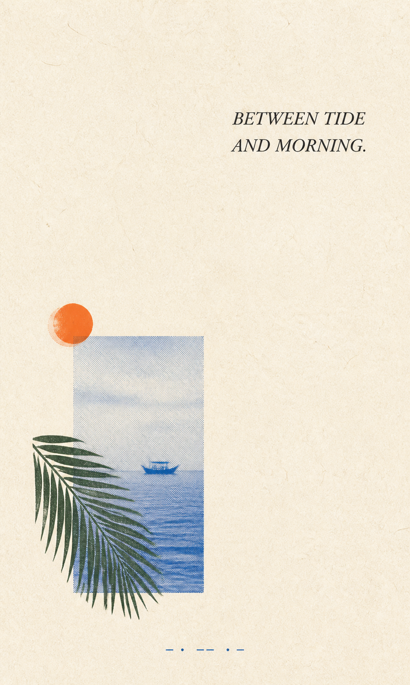

# Still Scenes Demo Set

These three images demonstrate distinct routes in the Still Scenes Postcard Zine skill. They were generated as original raster assets with the built-in image-generation tool. No stock photograph was downloaded, embedded, traced, or passed to the generator as an image reference.

Online images were used only to research broad, non-exclusive subject cues such as lantana color, Malaysian coastal motifs, rainy pavement, and bus-shelter atmosphere.

## Free-source research

| Theme | Research page | Creator shown by source | Use in this demo |
| --- | --- | --- | --- |
| Pink and yellow lantana | [Pexels: Vibrant Lantana Flowers in Bloom Outdoors](https://www.pexels.com/photo/vibrant-lantana-flowers-in-bloom-outdoors-34068705/) | Lily Lili | Botanical subject and natural color cues only |
| Malaysian coast | [Pexels: A Palm Tree on the Beach](https://www.pexels.com/photo/a-palm-tree-on-the-beach-18785837/) | irwan zahuri | General coastal place cues only |
| Rainy bus stop | [Pixabay: Rain Bus Stop](https://pixabay.com/photos/rain-bus-stop-bus-stop-street-1279578/) | brenkee | General rainy-transit atmosphere only |

License references checked during research:

- [Pexels License](https://www.pexels.com/license/) — permits free use and modification; attribution is not required, though appreciated. It prohibits selling unaltered copies and several misleading or trademark-related uses.
- [Pixabay Content License Summary](https://pixabay.com/service/license-summary/) — permits free use and adaptation without required attribution, subject to prohibited uses and possible third-party rights.

Always re-check the source page and current license before using an actual stock file. The generated demos below do not contain those stock files.

## Demo 01 — Lantana split postcard

File: generated/demo-01-lantana-split-postcard.png  
Dimensions: 1536 × 1024 px  
Route demonstrated: Postcard Create → split surface  
Locked copy check: passed

Alt text: Warm ivory landscape split postcard with a newly generated photograph of pink, lilac, white, and yellow lantana flowers on the left; Pontian location, date, exact caption, orange camera mark, and seven writing rules on the right.

### Final generation prompt

~~~text
Use case: stylized-concept
Asset type: polished demo image for the Still Scenes Postcard Zine skill
Primary request: Create an ORIGINAL landscape 3:2 split postcard, inspired only by the general subject of free-stock lantana flower photography, not by any single source composition.
Scene/backdrop: flat front-facing warm ivory matte paper with subtle natural fibers, no photographed mockup and no surrounding table.
Subject: on the left, a newly imagined vertical photographic print of small pink, lilac, white, and yellow lantana flower clusters against deep green leaves, natural garden light, gentle shallow focus, authentic botanical detail, no people.
Style/medium: refined personal postcard, editorial paper design, understated film photography, subtle print softness.
Composition/framing: left picture field occupies about 46% of the canvas with a generous ivory mat; a calm 4% gutter; right writing field occupies the remainder. On the right, place location and date at upper left, one small warm-orange outline camera mark at upper right, the caption below, then seven thin pale-taupe writing rules. Add one quiet footer divider and a tiny STILL SCENES mark. Keep generous safe margins and strong alignment.
Text (verbatim): "PONTIAN, JOHOR, MALAYSIA"; "APR 23, 2026"; "A SMALL BLOOM, HELD FOR LATER."; "STILL SCENES".
Typography: elegant italic editorial serif for the location; small utility sans for the date and footer; restrained dark-brown serif for the caption. Render each exact string once, with correct spelling and punctuation, and no additional words.
Color palette: warm ivory paper, dark leaf green, pink and lilac flowers, yellow-orange centers, near-black brown type, pale taupe rules, one warm orange camera accent.
Lighting/mood: flat diffuse scan-like presentation; tender, observant, quiet, personal.
Constraints: clean writing area; legible exact text; no watermark, no URL, no logo besides the requested tiny STILL SCENES text, no address, no postage value, no barcode, no official postal marks.
Avoid: copying the supplied example exactly, commercial ad layout, glossy mockup, hard shadow, 3D depth, dense scrapbook, arbitrary stickers, extra text, misspellings, tourism slogan, oversaturated HDR.
~~~

## Demo 02 — Rainy bus-stop front

File: generated/demo-02-rainy-bus-stop-front.png  
Dimensions: 1536 × 1024 px  
Route demonstrated: Postcard Create → generated picture → image front  
Locked copy check: passed

Alt text: Landscape postcard front showing an empty muted-red bus shelter on a wet residential street at blue hour, framed by warm ivory paper and captioned “THE RAIN LEFT FIRST.”

### Final generation prompt

~~~text
Use case: photorealistic-natural
Asset type: polished demo image for the Still Scenes Postcard Zine skill
Primary request: Create an ORIGINAL landscape 3:2 personal postcard front featuring a quiet red bus shelter after rain at blue hour. Use only the broad theme discovered in free-stock research; do not reproduce any specific source photograph, person, city, signage, route display, or composition.
Scene/backdrop: an ordinary residential street just after rainfall, cobalt-blue evening sky, wet pavement with restrained reflections, soft distant streetlights, no recognizable landmark.
Subject: one small simple red bus shelter with an empty bench; no people, no vehicles, no advertisements, no readable route numbers.
Style/medium: photorealistic natural street photography printed on matte paper, subtle 35mm film grain, honest everyday textures.
Composition/framing: wide eye-level photograph fills roughly 79% of the postcard inside a warm off-white paper border; shelter positioned slightly right of center, generous quiet wet street to the left. A clean warm-ivory caption band occupies the bottom 21% of the card. Place a tiny date-like dot and short rule as the only decorative marks.
Text (verbatim): "THE RAIN LEFT FIRST."
Typography: one line only, dark charcoal small uppercase editorial serif, aligned lower left in the caption band, generous tracking. Render the exact sentence once, including its final period, and no other words or numbers.
Color palette: cobalt blue, rain gray, deep charcoal, warm ivory paper, the shelter as the single muted vermilion-red anchor.
Lighting/mood: blue-hour ambient light, diffuse, contemplative, empty but not ominous.
Materials/textures: wet asphalt, painted metal, fogged shelter glass, fine paper fibers, gentle print softness.
Constraints: flat front-facing postcard artifact, legible exact caption, no watermark, no brand, no logo, no city identification, no route numbers, no ad poster, no extra text.
Avoid: copying a source image, cinematic blockbuster lighting, neon cyberpunk, dramatic person silhouette, commercial tourism layout, glossy mockup, hard shadow, 3D depth, heavy vignette, dense collage, misspelled text, extra objects.
~~~

## Demo 03 — Coastal scene-zine

File: generated/demo-03-coastal-scene-zine.png  
Dimensions: 971 × 1619 px  
Route demonstrated: Scene Zine Create → distilled scene  
Locked copy check: passed

Alt text: Vertical warm-paper zine page with large quiet space, an orange sun, cobalt halftone sea window and tiny fishing boat, overlapping dark-green palm frond, and the caption “BETWEEN TIDE AND MORNING.”

### Final generation prompt

~~~text
Use case: stylized-concept
Asset type: polished demo image for the Still Scenes Postcard Zine skill
Primary request: Create an ORIGINAL vertical 3:5 quiet scene-zine page that distills the broad idea of a peaceful Malaysian or Southeast Asian coast at dawn. Use only general motifs from free-stock research; do not reproduce any specific beach photograph, person, landmark, or exact composition.
Scene/backdrop: full-frame warm natural-white fibrous paper, flat orthographic scanned-paper appearance, no border and no photographed mockup.
Subject: one small visual relation near the lower-left third: a narrow cobalt-blue halftone window showing calm water and a single tiny traditional fishing boat, overlapped by one simplified dark-green palm frond printed as a dry-ink silhouette; a small vermilion-orange sun block sits just outside the window. No people.
Style/medium: poetic minimal editorial zine, restrained risograph and xerox print language, tactile but clean.
Composition/framing: keep about 76% of the page as open paper. Main cluster occupies about 20% of the canvas at the lower-left third. Balance it with one short caption placed in the upper-right third and one tiny date-like line near the bottom edge. Use no other decoration.
Text (verbatim): "BETWEEN TIDE AND MORNING."
Typography: exact sentence once, dark charcoal elegant italic serif, two balanced lines if needed, generous leading. No other readable words or numbers; the tiny bottom line is abstract, not text.
Color palette: warm paper, cobalt blue water, dark leaf green palm, charcoal type, one vermilion-orange sun accent.
Lighting/mood: quiet dawn, distant, humid, patient, diary-like.
Materials/textures: fine paper fibers, cobalt halftone dots, dry-ink palm edges, slight risograph misregistration only on the orange sun, low-to-medium contrast.
Constraints: one visual event, strong negative space, exact caption spelling and punctuation, no watermark, no logo, no location claim, no copied source wording.
Avoid: full-bleed beach scene, postcard tourism cliché, bright resort imagery, commercial headline hierarchy, CTA, glossy mockup, cinematic lighting, hard shadow, 3D depth, dense scrapbook, many objects, multicolor chaos, extra text, misspelled caption.
~~~

## Review result

All three files were inspected at full resolution after generation:

- required text is spelled correctly;
- no unexpected logo, watermark, URL, route number, address, or official postal mark is visible;
- the three outputs use distinct visual grammars;
- each image is an original AI-generated composition rather than a stock-photo derivative;
- all final artifacts are saved under demos/generated/.

## More demo collections

- [`EXTRA_DEMOS.md`](EXTRA_DEMOS.md) documents four additional original scene and postcard routes.
- [`USER_PHOTO_STYLE_DEMOS.md`](USER_PHOTO_STYLE_DEMOS.md) applies nine distinct styles to nine user-supplied photographs and includes every final prompt.
- [`USER_PHOTO_STYLE_DEMOS_EXPANSION.md`](USER_PHOTO_STYLE_DEMOS_EXPANSION.md) adds two more treatments per source, bringing the personal-photo gallery to 27 source-mapped outputs.
