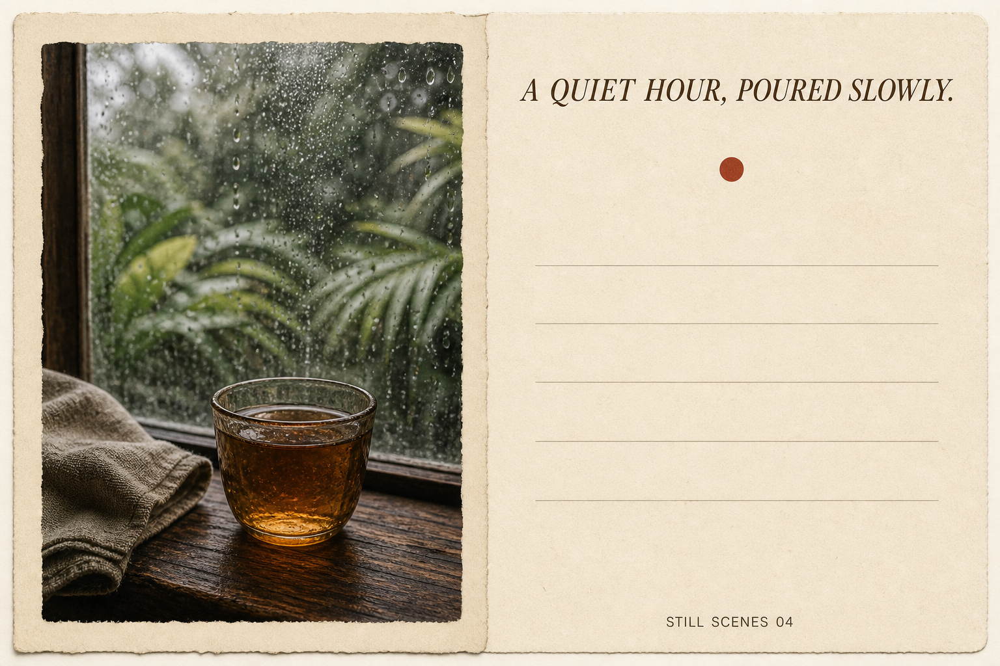
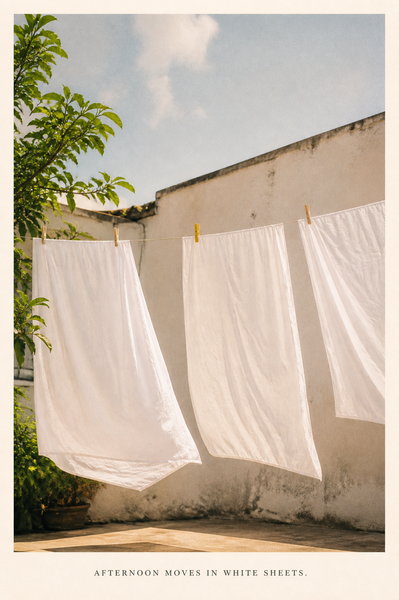
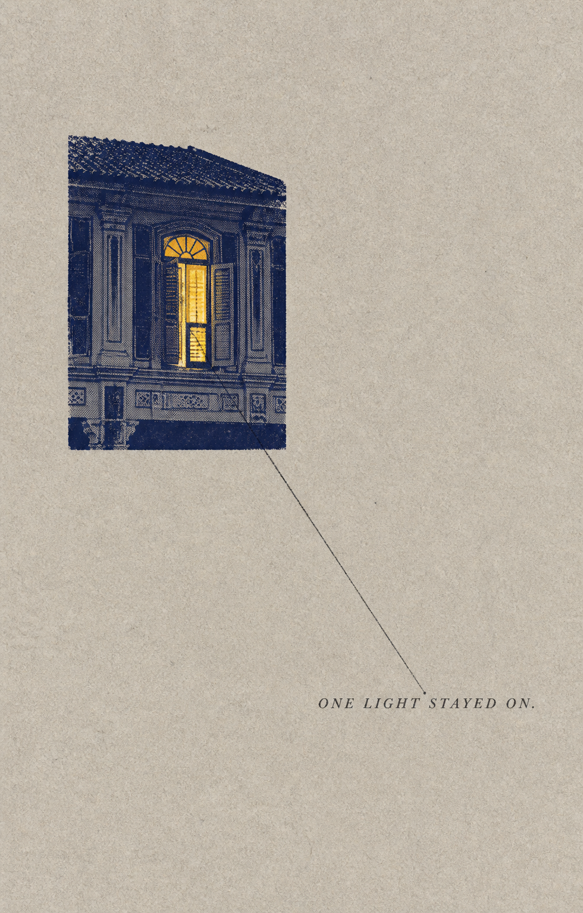
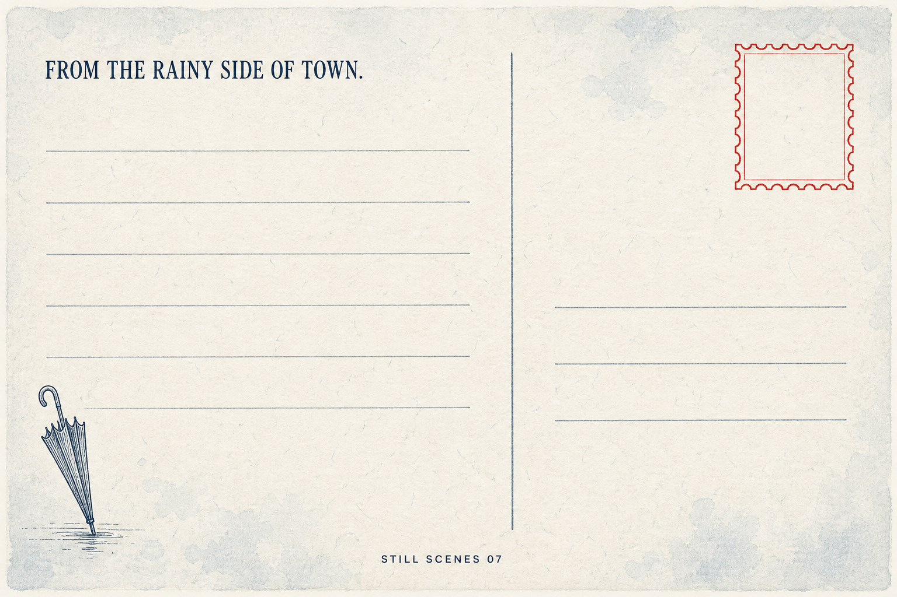

# Additional Original Scene Demos

These four assets extend the three foundational examples in [`DEMO.md`](DEMO.md). They were created as original raster compositions with the built-in image-generation tool and do not use a stock image or a photograph from the user's website.

The attempted website import returned no image export, and the follow-up web reader rejected the URL as unsafe to open. Rather than bypass that boundary, this batch uses newly generated scenes. The later [`USER_PHOTO_STYLE_DEMOS.md`](USER_PHOTO_STYLE_DEMOS.md) collection uses the user's supplied photographs directly.

## Demo 04 — Tea-window split card

- File: [`generated/demo-04-tea-window-split.png`](generated/demo-04-tea-window-split.png), 1536 × 1024
- Route: Postcard Create → split surface → generated scene
- Locked copy: `A QUIET HOUR, POURED SLOWLY.` / `STILL SCENES 04`

~~~text
Use case: stylized-concept
Asset type: demo image for the Still Scenes Postcard Zine skill
Primary request: Create an ORIGINAL landscape 3:2 field-note split postcard about tea beside a rain-speckled window.
Scene/backdrop: flat warm cream paper, front-facing scan, no tabletop mockup.
Subject: left 45% contains a newly generated vertical natural photograph of one small amber glass cup of tea on a dark wooden sill, a folded linen napkin, blurred tropical greenery and fine raindrops beyond the window; no people, no logos.
Style/medium: intimate editorial still-life photography with subtle film grain and matte print softness.
Composition/framing: photograph left inside a deckled paper mat; right side is spacious with location-like header replaced by the exact title, one tiny rust-red circular mark, five faint writing rules, and a quiet footer.
Text (verbatim): "A QUIET HOUR, POURED SLOWLY."; "STILL SCENES 04".
Typography: exact text once each; title in elegant dark-brown italic serif at upper right; footer in tiny uppercase utility sans. No other words or numbers.
Color palette: cream paper, amber tea, walnut brown, rain gray, deep leaf green, one rust-red accent.
Lighting/mood: soft overcast window light, contemplative and domestic.
Constraints: legible exact text, clean writing field, no watermark, brand, URL, address, barcode, or official postal mark.
Avoid: commercial café ad, product styling, glossy mockup, hard shadow, cinematic drama, dense scrapbook, extra props, extra text, misspellings.
~~~

## Demo 05 — Tropical laundry front

- File: [`generated/demo-05-tropical-laundry-front.png`](generated/demo-05-tropical-laundry-front.png), 1024 × 1536
- Route: Postcard Create → image-led front → generated scene
- Locked copy: `AFTERNOON MOVES IN WHITE SHEETS.`

~~~text
Use case: photorealistic-natural
Asset type: demo image for the Still Scenes Postcard Zine skill
Primary request: Create an ORIGINAL portrait 2:3 image-led personal postcard showing white laundry moving in a tropical afternoon breeze.
Scene/backdrop: modest sunlit courtyard in a Southeast Asian town, pale plaster wall, a few green leaves at the edge, no recognizable landmark.
Subject: three clean white cotton sheets hanging from a simple line, gently billowing; one small yellow clothespin is the chromatic anchor; no people, brands, or signage.
Style/medium: candid natural photography printed on warm matte paper, subtle film grain, real fabric texture.
Composition/framing: vertical photograph fills about 82% of the card with a narrow warm-ivory border; generous sky and wall; a restrained caption strip occupies the bottom.
Text (verbatim): "AFTERNOON MOVES IN WHITE SHEETS."
Typography: render exact sentence once in small charcoal uppercase editorial serif, centered in the bottom strip with generous tracking; no other text.
Color palette: sun-warmed white, pale plaster, quiet sky blue, leaf green, single mustard-yellow clothespin.
Lighting/mood: humid late afternoon, soft sun, airy, ordinary, tender.
Constraints: flat front-facing postcard, realistic sheets and clothespins, no watermark, logo, URL, address, or extra words.
Avoid: fashion campaign, resort styling, people, dramatic sunset, glossy mockup, hard shadow, 3D, dense collage, misspelled caption, extra objects.
~~~

## Demo 06 — Night-shophouse scene zine

- File: [`generated/demo-06-night-shophouse-zine.png`](generated/demo-06-night-shophouse-zine.png), 1003 × 1568
- Route: Scene Zine Create → distilled scene
- Locked copy: `ONE LIGHT STAYED ON.`

~~~text
Use case: stylized-concept
Asset type: demo image for the Still Scenes Postcard Zine skill
Primary request: Create an ORIGINAL vertical 3:5 minimal scene-zine page about one illuminated upstairs window in a quiet tropical shophouse at night.
Scene/backdrop: full-frame pale gray-beige fibrous paper, flat scanned-page appearance, no mockup.
Subject: one small rectangular midnight-blue halftone architectural fragment in the upper-left third, showing only the simplified facade rhythm of an old Southeast Asian shophouse and one warm yellow lit window; no signage, people, brands, or exact city.
Style/medium: quiet editorial collage, two-color risograph plus charcoal ink, dry printed edges.
Composition/framing: about 78% open paper; visual cluster about 18%; one thin line runs from the lit window toward a short caption in the lower-right third; no other decoration.
Text (verbatim): "ONE LIGHT STAYED ON."
Typography: exact sentence once in small charcoal italic serif, lower-right, generous letter spacing; no other readable text.
Color palette: gray-beige paper, midnight blue, charcoal, one saturated warm yellow window.
Lighting/mood: late night, still, distant, reassuring rather than eerie.
Constraints: one visual event, strong negative space, exact caption, no logo, watermark, location, signage, date, or extra words.
Avoid: full street scene, neon cyberpunk, cinematic noir, people, commercial poster, dense collage, 3D depth, glossy mockup, extra windows glowing, misspelled text.
~~~

## Demo 07 — Monsoon writing back

- File: [`generated/demo-07-monsoon-writing-back.png`](generated/demo-07-monsoon-writing-back.png), 1536 × 1024
- Route: Postcard Create → message-led back
- Locked copy: `FROM THE RAINY SIDE OF TOWN.` / `STILL SCENES 07`

~~~text
Use case: stylized-concept
Asset type: demo image for the Still Scenes Postcard Zine skill
Primary request: Create an ORIGINAL landscape 3:2 writable postcard back themed around monsoon rain.
Scene/backdrop: flat front-facing cool ivory paper with subtle blue-gray fibers and a faint rain-wash texture, no photographed mockup.
Subject: message-led postal surface, not a full picture. Add one tiny indigo line drawing of a folded umbrella near the lower-left and one vermilion empty stamp frame at upper-right.
Style/medium: refined personal stationery, letterpress and watercolor wash, restrained and functional.
Composition/framing: safe inset 4%; left 58% message field with seven pale blue-gray writing rules; right 34% recipient field with three shorter rules; one fine vertical divider; generous whitespace.
Text (verbatim): "FROM THE RAINY SIDE OF TOWN."; "STILL SCENES 07".
Typography: exact first sentence once at upper-left in dark indigo editorial serif; exact footer once in tiny uppercase utility sans at bottom center. No other letters or numbers.
Color palette: cool ivory, indigo, pale rain blue, charcoal, one vermilion accent.
Lighting/mood: calm monsoon afternoon, tactile, intimate.
Constraints: clearly a writable postcard back; legible exact text; decorative empty stamp frame only; no address, postage value, barcode, tracking marks, official postal symbols, logo, URL, watermark, or extra text.
Avoid: image-led front, full rainy scene, commercial stationery, glossy mockup, hard shadow, 3D, clutter, fake handwriting, misspellings.
~~~

## Review result

All four artifacts were visually inspected after generation. Captions are legible and correctly spelled; the surfaces are distinct; no unexpected logo, URL, watermark, address, or official postal mark is visible; and the generated originals remain preserved outside the project while non-overwriting copies are stored in both demo asset folders.
