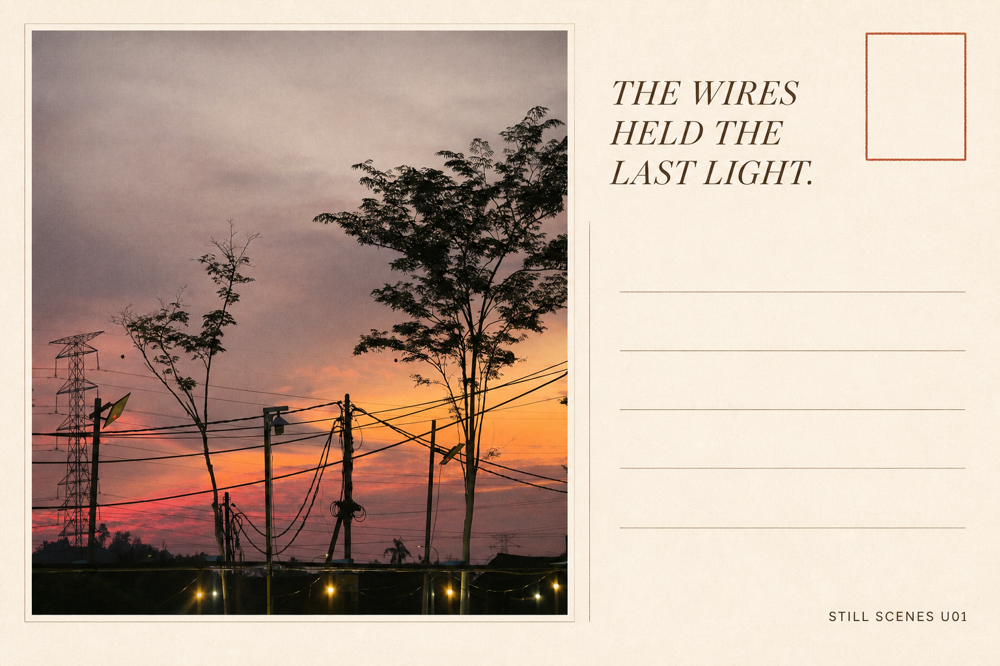
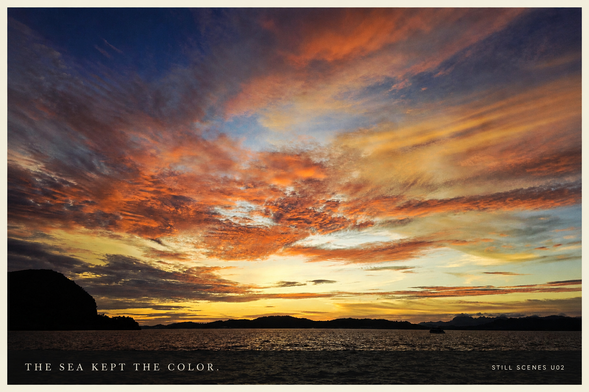
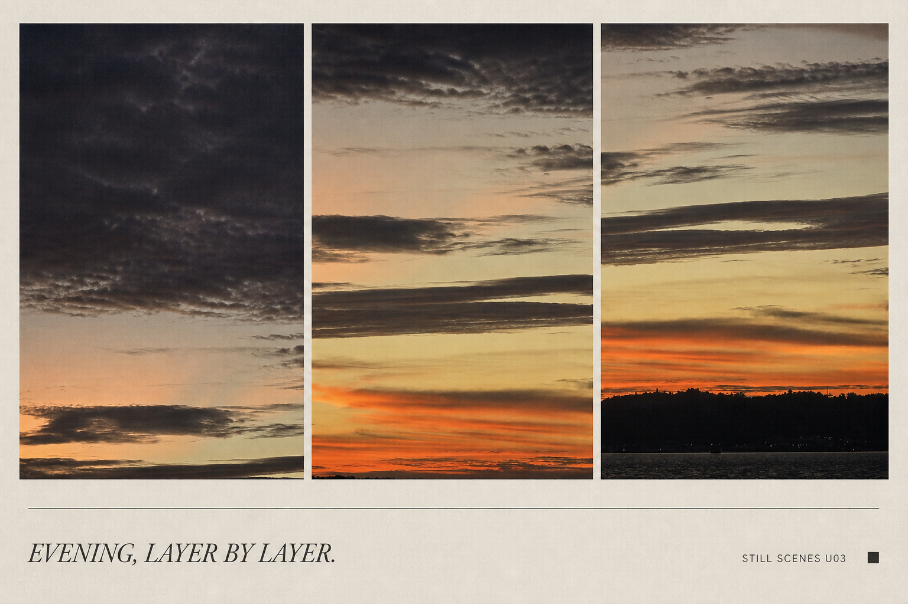
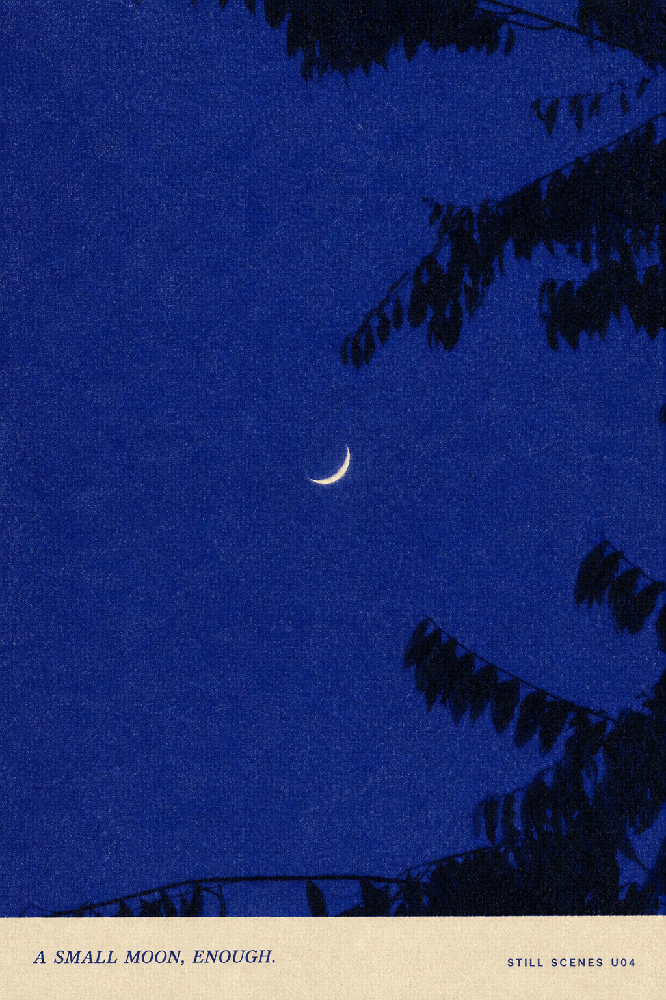
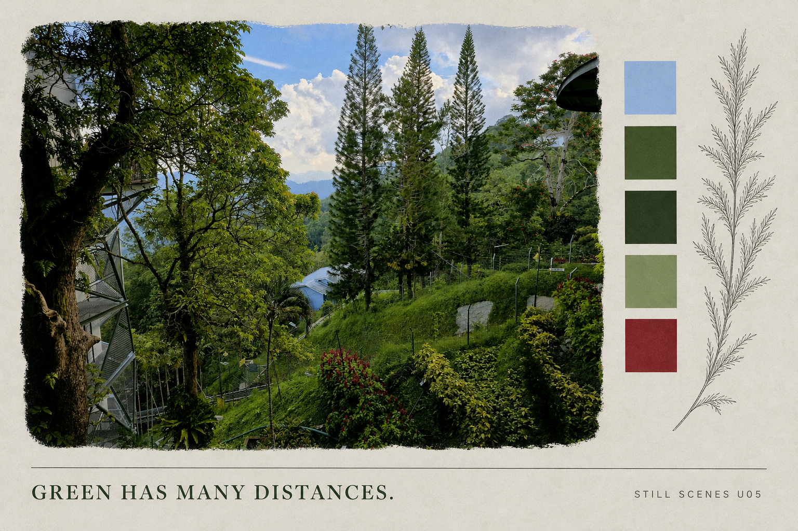
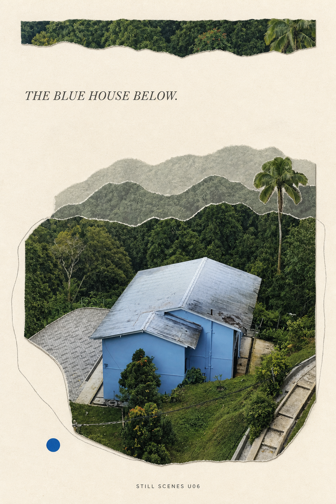
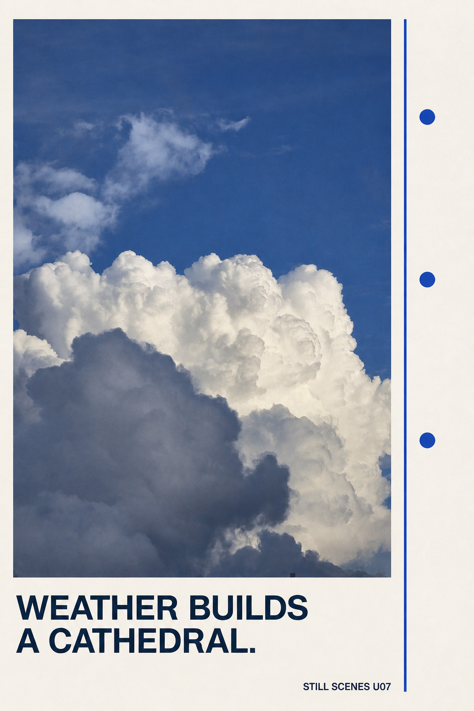
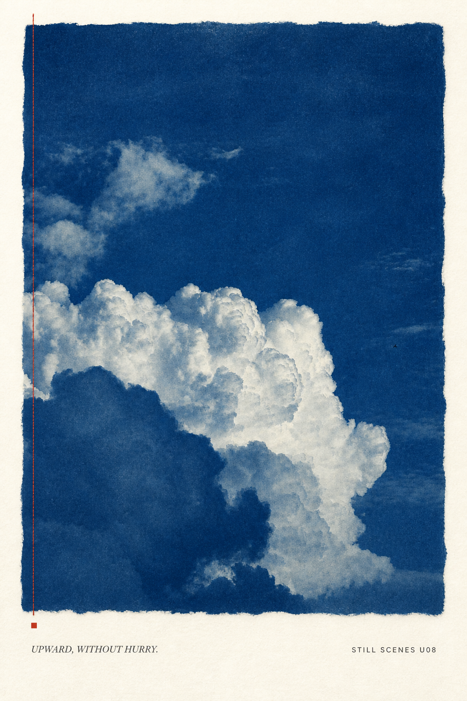

# User-Photo Style Demos

This is volume one, covering U01–U09. [`USER_PHOTO_STYLE_DEMOS_EXPANSION.md`](USER_PHOTO_STYLE_DEMOS_EXPANSION.md) adds U10–U27, bringing the collection to three treatments for each of the nine source photographs.

This collection turns every photograph from `QuickShare_2608102006.zip` into a different Still Scenes postcard or scene-zine treatment. The nine full-resolution JPEGs are preserved unchanged in [`user-photo-styles/source-photos/`](user-photo-styles/source-photos/). Reduced review references live in [`user-photo-styles/review-previews/`](user-photo-styles/review-previews/); they were used only because the camera-sized JPEG payloads exceeded the image service input limit.

The generated PNGs live in [`user-photo-styles/generated/`](user-photo-styles/generated/) and are copied, byte for byte, into `skills/still-scenes-postcard-zine/assets/user-photo-demos/`. [`MANIFEST.csv`](user-photo-styles/MANIFEST.csv) records the source/output pairing, hashes, dimensions, style, and locked caption.

## Style selector

| ID | Source | Treatment | Surface | Locked caption |
|---|---|---|---|---|
| U01 | Urban sunset and wires | Editorial split card | Writable postcard | `THE WIRES HELD THE LAST LIGHT.` |
| U02 | Sea sunset | Fine-art full bleed | Postcard front | `THE SEA KEPT THE COLOR.` |
| U03 | Banded sunset | Archival triptych | Scene postcard | `EVENING, LAYER BY LAYER.` |
| U04 | Crescent moon and leaves | Two-color risograph | Zine cover | `A SMALL MOON, ENOUGH.` |
| U05 | Hillside garden | Botanical field note | Scene postcard | `GREEN HAS MANY DISTANCES.` |
| U06 | Blue hillside house | Architectural paper collage | Zine page | `THE BLUE HOUSE BELOW.` |
| U07 | White cloud tower | Swiss modernist grid | Poster postcard | `WEATHER BUILDS A CATHEDRAL.` |
| U08 | White cloud tower and bird | Cyanotype artist book | Zine page | `UPWARD, WITHOUT HURRY.` |
| U09 | Orange-lit cloud | Vintage offset duotone | Postcard front | `THE CLOUD KEPT THE FIRE.` |

## Gallery and production prompts

Each prompt below is the exact prompt used for its displayed artifact. To reuse a style, attach another source image, keep the structural instructions, replace the visible-scene invariants, and substitute the locked caption and ID.

### U01 — Wires / split writable postcard

- Source: [`20250817_194352.jpg`](user-photo-styles/source-photos/20250817_194352.jpg)
- Output: [`demo-u01-wires-split-postcard.png`](user-photo-styles/generated/demo-u01-wires-split-postcard.png), 1536 × 1024
- Preservation: medium-high; source scene, infrastructure, silhouettes, and dusk palette remain identifiable

~~~text
Use case: image editing / high-fidelity layout transformation
Asset type: user-photo demo for the Still Scenes Postcard Zine skill
Primary request: Transform the supplied urban sunset photograph into a refined landscape 3:2 split postcard while keeping the photograph unmistakably recognizable.
Reference handling: Use the supplied photo as the only scene source. Preserve the pink-orange dusk, silhouetted trees, utility tower, poles, lamps, and layered overhead wires. Do not invent a different location or remove the documentary imperfections. A gentle crop and restrained print color grade are allowed.
Composition: Flat front-facing postcard on warm ivory paper, no tabletop mockup. Left 62% is the photograph inside a thin off-white mat. Right 38% is a calm writable panel with five faint horizontal rules, one fine divider, and a small empty rust-red stamp outline at upper right. Keep comfortable print-safe margins.
Style/medium: Contemporary editorial travel stationery, tactile uncoated paper, subtle film grain, quiet premium finish.
Text (verbatim): "THE WIRES HELD THE LAST LIGHT."; "STILL SCENES U01".
Typography: Render the first sentence exactly once in an elegant dark-brown italic serif at upper right, broken into at most three lines. Render the second exactly once in tiny uppercase sans at bottom right. No other words, letters, or numbers.
Color palette: warm ivory, charcoal, dusty rose, ember orange, one rust-red accent.
Mood: ordinary infrastructure made tender at dusk.
Constraints: exact legible text, recognizable source photo, writable space, no logo, URL, address, barcode, watermark, postage value, or official postal mark.
Avoid: glossy mockup, 3D perspective, removing all wires, adding people or vehicles, fantasy skyline, dense collage, extra text, misspellings.
~~~

### U02 — Sea / full-bleed photo postcard

- Source: [`20250916_192311.jpg`](user-photo-styles/source-photos/20250916_192311.jpg)
- Output: [`demo-u02-sea-full-bleed.png`](user-photo-styles/generated/demo-u02-sea-full-bleed.png), 1536 × 1024
- Preservation: high; horizon, islands, sea, boat, and sweeping cloud field remain photographic

~~~text
Use case: image editing / high-fidelity postcard design
Asset type: user-photo demo for the Still Scenes Postcard Zine skill
Primary request: Turn the supplied sea-at-sunset photograph into a timeless full-bleed landscape 3:2 postcard front.
Reference handling: Use the supplied photo as the only landscape source. Preserve the immense sweeping orange, gold, coral and blue cloud field, dark island silhouettes, low sea horizon, and tiny distant boat. Keep the real composition recognizable; use only a restrained cinematic grade and a crop that respects the wide sky.
Composition: The photograph fills the postcard inside a narrow warm-white border. Add a translucent ink-dark caption band only across the bottom 12%, leaving the horizon and dramatic sky visible. Flat front-facing print, no mockup.
Style/medium: Fine-art travel photography on matte cotton paper, soft film grain, subtle edge softness, classic editorial restraint.
Text (verbatim): "THE SEA KEPT THE COLOR."; "STILL SCENES U02".
Typography: First sentence exactly once in small warm-white uppercase serif with generous tracking, bottom left. Second exactly once in tiny warm-white uppercase sans, bottom right. No other readable text.
Color palette: derive from the source—deep navy, ember orange, pale gold, charcoal sea—with warm-white type.
Mood: expansive, slow, quietly spectacular.
Constraints: exact legible text, recognizable supplied photograph, no added landmarks, people, logos, URL, date, watermark, barcode, or postal marks.
Avoid: over-HDR, surreal recoloring, fake sun, added birds, commercial tourism ad, 3D mockup, heavy vignette, extra text, misspellings.
~~~

### U03 — Evening / archival triptych

- Source: [`20250916_193430.jpg`](user-photo-styles/source-photos/20250916_193430.jpg)
- Output: [`demo-u03-evening-triptych.png`](user-photo-styles/generated/demo-u03-evening-triptych.png), 1536 × 1024
- Preservation: medium-high; three crops come from one source image and retain its cloud/horizon sequence

~~~text
Use case: image editing / editorial collage
Asset type: user-photo demo for the Still Scenes Postcard Zine skill
Primary request: Recompose the supplied banded sunset photograph as a landscape 3:2 archival triptych postcard.
Reference handling: Use only the supplied photograph. Preserve its dark upper cloud ceiling, long horizontal cloud bands, orange strip at the horizon, black hill silhouette, and thin waterline. Create three adjacent crops from the same image—upper cloud, glowing middle atmosphere, lower horizon—without inventing new scenery.
Composition: Flat warm-gray paper card. Three equal vertical photographic panels occupy the upper 72%, separated by narrow cream gutters. Lower 28% is an open caption field with one hairline rule and a tiny square registration mark. Keep generous outer margins.
Style/medium: Museum contact-sheet meets quiet zine, matte offset print, slight grain and natural tonal variation.
Text (verbatim): "EVENING, LAYER BY LAYER."; "STILL SCENES U03".
Typography: First sentence exactly once in dark charcoal italic serif at lower left. Second exactly once in tiny uppercase sans at lower right. No other text or numbers.
Color palette: source charcoal, muted apricot, smoke gray, dusk green, warm paper.
Mood: observational, sequential, patient.
Constraints: exact readable text, all three panels visibly derived from the supplied photo, no people, logo, URL, location, date, watermark, or postal artifacts.
Avoid: three different landscapes, kaleidoscope, scrapbook clutter, glossy mockup, 3D shadows, over-saturation, decorative stickers, extra text, misspellings.
~~~

### U04 — Small moon / risograph cover

- Source: [`20250925_192842.jpg`](user-photo-styles/source-photos/20250925_192842.jpg)
- Output: [`demo-u04-small-moon-risograph.png`](user-photo-styles/generated/demo-u04-small-moon-risograph.png), 1024 × 1536
- Preservation: medium-high; crescent scale, negative space, and leaf framing are retained

~~~text
Use case: image editing / stylized zine transformation
Asset type: user-photo demo for the Still Scenes Postcard Zine skill
Primary request: Transform the supplied crescent-moon photograph into a vertical 2:3 minimal risograph scene-zine cover while preserving the photographed composition.
Reference handling: Use the supplied photo as the only scene source. Preserve the slim bright crescent low in the deep blue sky and the irregular leaf silhouettes entering from the top and right edges. Keep the moon's scale and quiet negative space; do not add stars, buildings, or a larger moon.
Composition: Flat front-facing fibrous midnight-blue paper. The image occupies the full page with the source composition intact. Introduce subtle two-ink halftone texture and one narrow warm-ivory footer strip at the bottom 10%.
Style/medium: Two-color risograph—indigo and black—with the crescent left as warm paper white, slight ink misregistration, dry tactile grain.
Text (verbatim): "A SMALL MOON, ENOUGH."; "STILL SCENES U04".
Typography: First sentence exactly once in small dark-indigo italic serif at lower left within the footer. Second exactly once in tiny uppercase sans at lower right. No other text or numbers.
Color palette: saturated indigo, blue-black leaf silhouettes, warm ivory, one faint silver-blue tint.
Mood: hushed, spare, intimate.
Constraints: crescent and leaf framing must remain recognizable from the supplied image; exact readable text; no logo, URL, date, watermark, postal mark, or added objects.
Avoid: star field, full moon, galaxy fantasy, people, city skyline, glossy mockup, 3D shadow, dense decoration, extra text, misspellings.
~~~

### U05 — Green / botanical field note

- Source: [`20250927_174531.jpg`](user-photo-styles/source-photos/20250927_174531.jpg)
- Output: [`demo-u05-green-field-note.png`](user-photo-styles/generated/demo-u05-green-field-note.png), 1536 × 1024
- Preservation: high; landscape depth, vegetation, fences, paths, and architecture remain visible

~~~text
Use case: image editing / editorial field-note layout
Asset type: user-photo demo for the Still Scenes Postcard Zine skill
Primary request: Turn the supplied hillside garden photograph into a landscape 3:2 botanical field-note postcard without losing its real depth and structures.
Reference handling: Use the supplied photo as the only landscape source. Preserve the large shaded tree at left, the tall narrow conifers, blue sky and clouds, layered green hillside, red foliage accents, paths, fences, and glimpses of buildings. Do not replace it with a generic forest.
Composition: Flat front-facing warm sage-gray card. A large irregular-edged photographic window fills the left 72%. On the right 22%, arrange five small unlabeled rectangular color swatches sampled from the photograph, one fine vertical botanical line drawing, and generous open paper. Add a thin caption baseline across the bottom.
Style/medium: Natural-history field notebook meets modern editorial postcard, matte paper, restrained graphite details, subtle photographic grain.
Text (verbatim): "GREEN HAS MANY DISTANCES."; "STILL SCENES U05".
Typography: First sentence exactly once in dark forest-green serif at bottom left. Second exactly once in tiny uppercase sans at bottom right. No plant names, labels, coordinates, or other text.
Color palette: moss, pine, fern, pale sky blue, warm gray paper, small red accents derived from the source.
Mood: observant, cool, layered, restorative.
Constraints: recognizable supplied garden photo, exact readable text, blank swatches only, no logo, URL, location, date, watermark, people, or postal artifacts.
Avoid: tropical resort ad, fantasy jungle, removing all man-made structures, dense scrapbook, glossy mockup, 3D, fake labels, extra text, misspellings.
~~~

### U06 — Blue house / architectural paper collage

- Source: [`20250927_175045.jpg`](user-photo-styles/source-photos/20250927_175045.jpg)
- Output: [`demo-u06-blue-house-collage.png`](user-photo-styles/generated/demo-u06-blue-house-collage.png), 1024 × 1536
- Preservation: medium; the house, roof, stairs, palm, forest, and elevated viewpoint remain identifiable

~~~text
Use case: image editing / architectural paper collage
Asset type: user-photo demo for the Still Scenes Postcard Zine skill
Primary request: Reinterpret the supplied vertical photograph of a blue hillside house as a portrait 2:3 architectural scene postcard.
Reference handling: Use only the supplied photograph. Preserve the pale-blue house, silver pitched roof, stairs at the right edge, dense layered forest, single tall palm, and elevated viewpoint. Keep the house's actual simple geometry recognizable and do not invent doors, signage, or people.
Composition: Flat warm-off-white paper. The house and immediate slope appear as a carefully cut photographic shape in the lower half; the surrounding forest becomes three overlapping torn-paper tonal layers behind it. Retain a narrow strip of the original photographic detail at the top as a visual key. Plenty of quiet paper around the cluster.
Style/medium: Hand-cut editorial collage with matte photographic paper, graphite contour lines, subtle fiber texture, one cobalt-blue registration dot.
Text (verbatim): "THE BLUE HOUSE BELOW."; "STILL SCENES U06".
Typography: First sentence exactly once in charcoal italic serif near the upper-left open area. Second exactly once in tiny uppercase sans near the bottom edge. No other readable text.
Color palette: pale house blue, silver gray, forest green, warm white, charcoal, one cobalt accent.
Mood: sheltered, elevated, quietly geometric.
Constraints: source house and forest must remain identifiable; exact text; no logo, URL, address, date, watermark, people, or postal markings.
Avoid: luxury real-estate ad, changing house color, fantasy cabin, adding roads or cars, busy scrapbook, glossy mockup, drop-shadow 3D, extra text, misspellings.
~~~

### U07 — Weather / Swiss editorial poster

- Source: [`20250927_182437.jpg`](user-photo-styles/source-photos/20250927_182437.jpg)
- Output: [`demo-u07-weather-swiss.png`](user-photo-styles/generated/demo-u07-weather-swiss.png), 1024 × 1536
- Preservation: high; actual cloud contours, blue space, and dark foreground cloud remain photographic
- Source note: the JPEG decoder reports extra marker bytes; the file is readable and was intentionally preserved unchanged

~~~text
Use case: image editing / Swiss editorial poster
Asset type: user-photo demo for the Still Scenes Postcard Zine skill
Primary request: Transform the supplied vertical cloud photograph into a portrait 2:3 Swiss-modernist scene postcard.
Reference handling: Use the supplied photo as the only cloud source. Preserve the enormous sunlit white cumulus rising from the lower frame, the deep blue negative-space sky, and the darker foreground cloud. Keep the actual cloud contours recognizable; do not add aircraft, buildings, or fantasy forms.
Composition: Flat cool-white uncoated paper. Place a large rectangular photographic window from the left edge to 78% width, extending from 6% top to 78% bottom. A narrow cobalt grid rail runs down the right side with three small solid circles but no labels. The caption occupies the open bottom band, aligned to the same grid.
Style/medium: International Typographic Style, museum-poster precision, crisp grid, subtle matte grain.
Text (verbatim): "WEATHER BUILDS A CATHEDRAL."; "STILL SCENES U07".
Typography: First sentence exactly once in bold dark-navy uppercase grotesk, bottom left, on no more than two lines. Second exactly once in tiny uppercase sans, bottom right. No other words, letters, or numbers.
Color palette: source sky blue and cloud white, cool paper, dark navy, one cobalt accent.
Mood: monumental yet calm.
Constraints: recognizable supplied cloud photograph, exact legible text, no logo, URL, date, watermark, location, people, or postal markings.
Avoid: religious symbols, literal cathedral architecture, surreal creatures, extra clouds, glossy mockup, 3D shadows, gradients outside the photo, extra text, misspellings.
~~~

### U08 — Upward / cyanotype artist page

- Source: [`20250927_182447.jpg`](user-photo-styles/source-photos/20250927_182447.jpg)
- Output: [`demo-u08-cloud-cyanotype.png`](user-photo-styles/generated/demo-u08-cloud-cyanotype.png), 1024 × 1536
- Preservation: medium-high; cloud silhouette, open sky, foreground shadow, and tiny bird are retained

~~~text
Use case: image editing / cyanotype art print
Asset type: user-photo demo for the Still Scenes Postcard Zine skill
Primary request: Recast the supplied vertical cloud photograph as a portrait 2:3 cyanotype scene-zine page while preserving the photographed cloud formation.
Reference handling: Use the supplied image as the sole subject. Preserve the bright towering cumulus in the lower-left half, the wide open upper sky, darker foreground cloud, and tiny bird at right. Keep contours and scale recognizable; do not add new birds or objects.
Composition: Flat warm-white fibrous page. Center one large deckle-edged cyanotype print with wide lower margin. Overlay a single hair-thin vermilion vertical stitch along the print's left edge and a tiny vermilion square below; nothing else decorative.
Style/medium: Hand-coated Prussian-blue cyanotype, naturally uneven edges, soft paper fibers, archival artist-book restraint.
Text (verbatim): "UPWARD, WITHOUT HURRY."; "STILL SCENES U08".
Typography: First sentence exactly once in small charcoal italic serif below the print at left. Second exactly once in tiny uppercase sans below at right. No other readable text.
Color palette: Prussian blue, pale cyan, paper white, charcoal, one vermilion accent.
Mood: airy, tactile, patient.
Constraints: supplied cloud silhouette remains recognizable, exact readable text, keep the tiny bird, no logo, URL, date, watermark, postal marks, people, or invented scenery.
Avoid: blueprint labels, star map, multiple birds, fantasy castle clouds, glossy mockup, 3D drop shadows, dense collage, extra text, misspellings.
~~~

### U09 — Fire cloud / vintage offset duotone

- Source: [`20250927_190614.jpg`](user-photo-styles/source-photos/20250927_190614.jpg)
- Output: [`demo-u09-cloud-vintage-duotone.png`](user-photo-styles/generated/demo-u09-cloud-vintage-duotone.png), 1536 × 1024
- Preservation: medium-high; central cloud mass, surrounding gray layers, and warm natural lighting remain recognizable

~~~text
Use case: image editing / vintage duotone postcard
Asset type: user-photo demo for the Still Scenes Postcard Zine skill
Primary request: Turn the supplied glowing sunset-cloud photograph into a landscape 3:2 vintage offset postcard front.
Reference handling: Use the supplied photo as the only scene source. Preserve the central billowing cloud mass lit warm orange from within, the surrounding slate-gray cloud layers, and the low dark base. Maintain its recognizably photographic shape and dramatic natural light; do not add a sun or landscape.
Composition: Flat front-facing card on muted apricot stock. The photograph fills a wide oval-cornered window occupying 88% of the card. A thick burnt-orange rule frames the window, and a small cream caption tab overlaps the lower-left edge. Keep generous edge margins.
Style/medium: Late-1970s editorial offset print, two-pass ink texture, restrained halftone, slightly imperfect registration, matte paper.
Text (verbatim): "THE CLOUD KEPT THE FIRE."; "STILL SCENES U09".
Typography: First sentence exactly once in dark umber uppercase serif inside the cream caption tab. Second exactly once in tiny uppercase sans at the lower-right paper margin. No other readable text.
Color palette: burnt orange, apricot, smoke gray, dark umber, cream.
Mood: warm, weighty, fleeting.
Constraints: source cloud remains recognizable, exact legible text, no logo, URL, location, date, watermark, people, birds, or postal artifacts.
Avoid: flames, explosion, disaster imagery, fantasy landscape, glossy commercial mockup, heavy 3D shadow, modern neon palette, extra text, misspellings.
~~~

## Reuse contract

For a new user-selected image and caption:

1. Inspect the image and record subject, orientation, visible text, private-location risk, and identity-sensitive details.
2. Choose one treatment from U01–U09, then rewrite only the `Reference handling`, `Text (verbatim)`, palette, and preservation invariants.
3. Keep captions locked character-for-character and short enough for the chosen layout.
4. Include the image through the runtime reference mechanism; never reconstruct a personal photo from description alone.
5. Compare the result with the source and verify the caption before delivery.

These demos intentionally print no inferred location or date. The ZIP, original photographs, and full-resolution metadata remain local to this workspace.
