# User-Photo Style Expansion — U10–U27

This volume adds two more treatments for each of the nine photographs documented in [`USER_PHOTO_STYLE_DEMOS.md`](USER_PHOTO_STYLE_DEMOS.md). Together, U01–U27 provide exactly three styles per source photograph. Every generated image is stored in [`user-photo-styles/generated/`](user-photo-styles/generated/) and mirrored byte-for-byte into `skills/still-scenes-postcard-zine/assets/user-photo-demos/`.

[`user-photo-styles/MANIFEST.csv`](user-photo-styles/MANIFEST.csv) is the authoritative source/output index, including dimensions and SHA-256 hashes.

## Three-style matrix

| Source photograph | First treatment | Second treatment | Third treatment |
|---|---|---|---|
| `20250817_194352.jpg` — urban wires | U01 split writable postcard | U10 documentary newsprint | U11 geometric photo collage |
| `20250916_192311.jpg` — sea sunset | U02 full-bleed photo front | U12 watercolor diary | U13 darkroom contact print |
| `20250916_193430.jpg` — banded sunset | U03 archival triptych | U14 accordion strips | U15 reduction monoprint |
| `20250925_192842.jpg` — crescent moon | U04 two-color risograph | U16 silver-gelatin nocturne | U17 celestial field note |
| `20250927_174531.jpg` — hillside garden | U05 botanical field note | U18 woven jacquard | U19 topographic map fold |
| `20250927_175045.jpg` — blue house | U06 architectural collage | U20 photographic blueprint | U21 colored-pencil diary |
| `20250927_182437.jpg` — cloud tower | U07 Swiss editorial | U22 monochrome lithograph | U23 embossed paper relief |
| `20250927_182447.jpg` — cloud and bird | U08 cyanotype | U24 four-ink screenprint | U25 dry-pastel sky study |
| `20250927_190614.jpg` — orange cloud | U09 vintage duotone | U26 stained glass | U27 encaustic photo transfer |

## Exact production prompts

### U10 — Urban wires / documentary newsprint

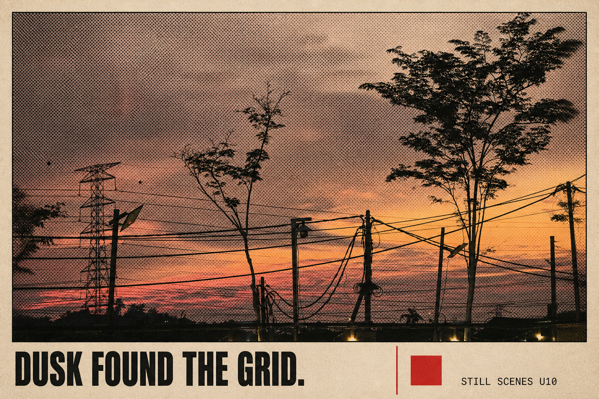

- Source: [`20250817_194352.jpg`](user-photo-styles/source-photos/20250817_194352.jpg)
- Output: [`demo-u10-wires-newsprint.png`](user-photo-styles/generated/demo-u10-wires-newsprint.png), 1536 × 1024

~~~text
Use case: image editing / documentary newsprint transformation
Asset type: user-photo demo U10 for the Still Scenes Postcard Zine skill
Primary request: Transform the supplied urban sunset photograph into a landscape 3:2 documentary broadsheet postcard while preserving the real scene.
Reference handling: Use the supplied photo as the sole scene source. Preserve the pink-orange dusk, silhouetted trees, utility tower, poles, lamps, and dense crossing wires. Keep the imperfect infrastructure prominent rather than beautifying it into a generic skyline.
Composition: Flat front-facing warm-gray newsprint card. The photograph occupies the upper 78% as one wide halftone image with a thin black keyline. The bottom 22% is an ivory caption band divided by one vertical red rule and a small solid red square. No columns of body copy.
Style/medium: Independent photojournalism broadsheet, coarse black-and-warm-gray halftone with selective ember-red ink, fibrous uncoated stock, restrained ink spread.
Text (verbatim): "DUSK FOUND THE GRID."; "STILL SCENES U10".
Typography: Render the first sentence exactly once in bold condensed black uppercase sans at bottom left. Render the second exactly once in tiny uppercase mono at bottom right. No other words, letters, or numbers.
Color palette: charcoal, warm gray, dusty rose, ember red, ivory.
Mood: observed, urban, unsentimental, quietly warm.
Constraints: recognizable supplied photograph; exact readable text; no people, cars, new buildings, logo, URL, location, date, watermark, barcode, or postal marks.
Avoid: glossy magazine, cyberpunk neon, removing wires, cinematic skyline, fake newspaper articles, extra text, 3D mockup, misspellings.
~~~

### U11 — Urban wires / geometric photo collage

- Source: [`20250817_194352.jpg`](user-photo-styles/source-photos/20250817_194352.jpg)
- Output: [`demo-u11-wires-geometric.png`](user-photo-styles/generated/demo-u11-wires-geometric.png), 1536 × 1024

~~~text
Use case: image editing / geometric modernist collage
Asset type: user-photo demo U11 for the Still Scenes Postcard Zine skill
Primary request: Recompose the supplied urban sunset as a landscape 3:2 geometric photo-collage postcard, keeping its infrastructure and dusk unmistakably recognizable.
Reference handling: Use only the supplied photo. Preserve the main tree silhouettes, power tower, lamps, poles, wires, and saturated sunset strip. Do not erase or redraw the wires; let their real diagonals organize the composition.
Composition: Flat cream paper. Place the full photograph in a wide central rectangle occupying 74% of the card. Overlay only three simple translucent shapes—a rust circle behind the tower, a narrow cobalt rectangle near one lamp, and a cream semicircle at the lower edge—without covering the defining scene. Add two hairline grid rules and generous margins.
Style/medium: 1920s-inspired geometric editorial design interpreted as contemporary matte photo collage, crisp shapes, subtle paper grain, no historical logos.
Text (verbatim): "LINES CROSSING THE EVENING."; "STILL SCENES U11".
Typography: First sentence exactly once in dark charcoal uppercase geometric sans along the upper-left margin. Second exactly once in tiny uppercase sans at lower right. No other readable text.
Color palette: cream, charcoal, source coral-pink, rust, cobalt blue.
Mood: rhythmic, graphic, still recognizably documentary.
Constraints: source scene and wire network remain identifiable; exact text; no people, vehicles, logos, URL, date, location, watermark, or postal marks.
Avoid: abstracting away the photograph, extra geometric clutter, constructivist propaganda, glossy mockup, 3D shadow, neon, extra words, misspellings.
~~~

### U12 — Sea sunset / watercolor diary

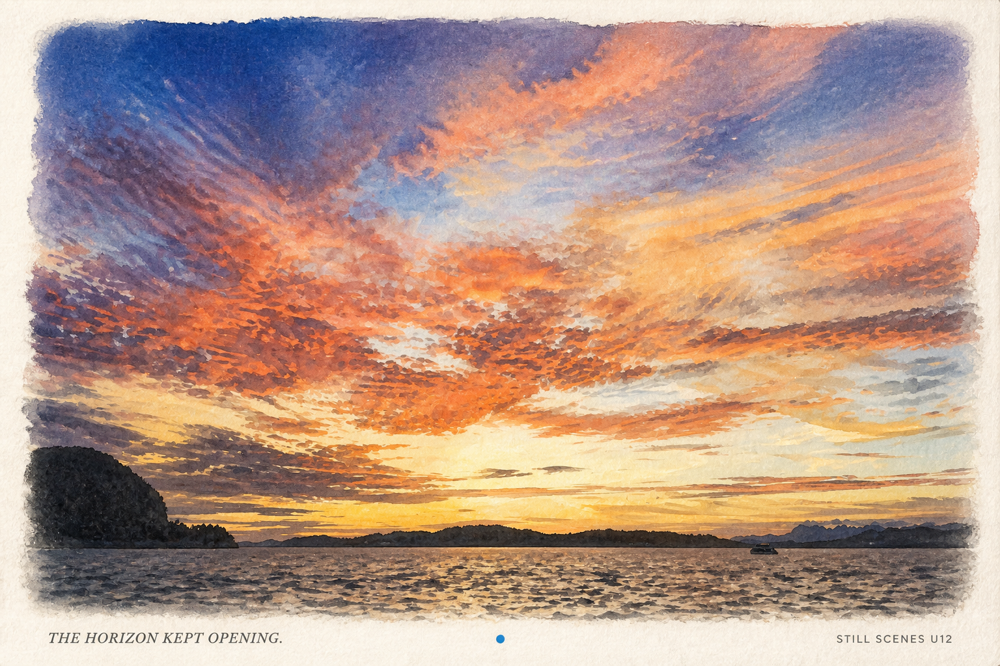

- Source: [`20250916_192311.jpg`](user-photo-styles/source-photos/20250916_192311.jpg)
- Output: [`demo-u12-sea-watercolor.png`](user-photo-styles/generated/demo-u12-sea-watercolor.png), 1536 × 1024

~~~text
Use case: image editing / watercolor travel diary
Asset type: user-photo demo U12 for the Still Scenes Postcard Zine skill
Primary request: Transform the supplied sea-sunset photograph into a landscape 3:2 watercolor memory postcard while retaining the source composition.
Reference handling: Use the supplied image as the only landscape reference. Preserve the sweeping coral, orange, gold, and blue cloud field, dark island silhouettes, low sea horizon, and tiny distant boat. The watercolor interpretation must follow the real cloud directions and horizon rather than inventing a new coast.
Composition: Flat cold-press ivory paper. A large soft-edged watercolor image fills 86% of the card, with pigment feathering into the margins. Leave a clean narrow strip at the bottom for the caption and one tiny hand-painted ultramarine dot.
Style/medium: Transparent watercolor and graphite travel journal, visible paper tooth, layered washes, restrained granulation, no photorealistic gloss.
Text (verbatim): "THE HORIZON KEPT OPENING."; "STILL SCENES U12".
Typography: First sentence exactly once in small charcoal italic serif at bottom left. Second exactly once in tiny uppercase sans at bottom right. No handwriting and no other text.
Color palette: source ultramarine, coral, burnt orange, pale gold, charcoal, ivory.
Mood: expansive, remembered, breathable.
Constraints: recognizable source horizon, islands, cloud sweep, and boat; exact legible text; no added sun, birds, people, buildings, logo, URL, date, watermark, or postal marks.
Avoid: generic beach painting, tropical resort imagery, opaque gouache, fantasy islands, decorative travel stamps, 3D mockup, extra words, misspellings.
~~~

### U13 — Sea sunset / analog darkroom contact print

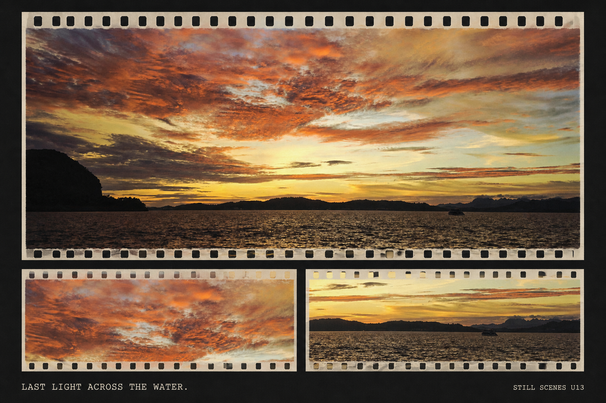

- Source: [`20250916_192311.jpg`](user-photo-styles/source-photos/20250916_192311.jpg)
- Output: [`demo-u13-sea-darkroom.png`](user-photo-styles/generated/demo-u13-sea-darkroom.png), 1536 × 1024

~~~text
Use case: image editing / analog darkroom contact print
Asset type: user-photo demo U13 for the Still Scenes Postcard Zine skill
Primary request: Recast the supplied sea-sunset photograph as a landscape 3:2 analog-film contact postcard while keeping the landscape photographic and recognizable.
Reference handling: Use only the supplied photo. Preserve the wide radiating cloud field, orange-gold center, dark island silhouettes, water texture, low horizon, and tiny boat. Do not introduce a new coast, sun disk, or subjects.
Composition: Flat charcoal-black paper card. Place one panoramic crop across the upper two-thirds and two smaller detail frames beneath it—one cloud detail and one sea/horizon detail—all visibly from the same source. Use narrow warm-white film borders with blank perforation shapes but no frame numbers. Caption sits in a slim black footer.
Style/medium: Hand-printed color darkroom contact sheet, slightly lifted blacks, fine film grain, subtle chemical edge marks, matte fiber paper.
Text (verbatim): "LAST LIGHT ACROSS THE WATER."; "STILL SCENES U13".
Typography: First sentence exactly once in small warm-white uppercase mono at lower left. Second exactly once in tiny uppercase mono at lower right. No other text or numbers.
Color palette: charcoal, warm white, source amber, coral, deep navy.
Mood: archival, cinematic, reflective.
Constraints: all panels derived from the supplied photograph; exact readable text; no people, added boats, logos, URL, date, location, watermark, barcode, or postal marks.
Avoid: film-brand markings, fake frame numbers, movie poster, over-HDR, glossy mockup, 3D depth, extra words, misspellings.
~~~

### U14 — Banded sunset / accordion strips

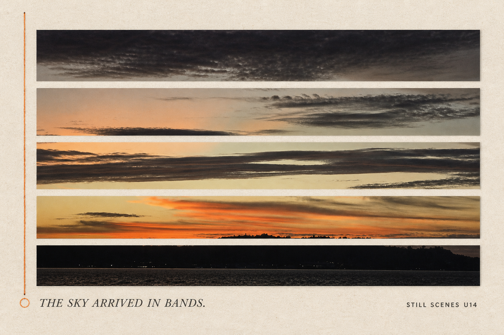

- Source: [`20250916_193430.jpg`](user-photo-styles/source-photos/20250916_193430.jpg)
- Output: [`demo-u14-evening-strips.png`](user-photo-styles/generated/demo-u14-evening-strips.png), 1536 × 1024

~~~text
Use case: image editing / horizontal strip composition
Asset type: user-photo demo U14 for the Still Scenes Postcard Zine skill
Primary request: Transform the supplied banded sunset photograph into a landscape 3:2 accordion-strip scene postcard.
Reference handling: Use the supplied photo as the only visual source. Preserve its dark upper cloud ceiling, long horizontal mid-sky bands, narrow orange horizon, black hill silhouette, and waterline. Slice the same photograph into horizontal strips without inventing new scenery.
Composition: Flat pale stone paper. Arrange five long photographic strips across the card with alternating narrow and wide heights, each aligned to reconstruct the source from top sky to water while leaving slim paper gaps. Add one vertical orange thread line near the left margin and a small open circle.
Style/medium: Contemporary artist-book accordion study, matte photo fragments, precision cut edges, tactile paper fibers.
Text (verbatim): "THE SKY ARRIVED IN BANDS."; "STILL SCENES U14".
Typography: First sentence exactly once in charcoal italic serif at lower left beneath the strips. Second exactly once in tiny uppercase sans at lower right. No other readable text.
Color palette: source charcoal, smoke gray, muted apricot, ember orange, pale stone.
Mood: measured, sequential, atmospheric.
Constraints: five strips must clearly belong to the supplied photograph and preserve top-to-bottom order; exact text; no people, logos, URL, date, location, watermark, or postal marks.
Avoid: unrelated strip images, rainbow palette, scrapbook tape, dense annotations, glossy mockup, 3D shadows, extra text, misspellings.
~~~

### U15 — Banded sunset / reduction monoprint

- Source: [`20250916_193430.jpg`](user-photo-styles/source-photos/20250916_193430.jpg)
- Output: [`demo-u15-evening-monoprint.png`](user-photo-styles/generated/demo-u15-evening-monoprint.png), 1536 × 1024

~~~text
Use case: image editing / reduction monoprint
Asset type: user-photo demo U15 for the Still Scenes Postcard Zine skill
Primary request: Reinterpret the supplied banded sunset as a landscape 3:2 reduction-monoprint postcard while preserving its horizon and layered cloud rhythm.
Reference handling: Use only the supplied photograph. Preserve the heavy dark cloud at the top, elongated mid-level cloud shapes, thin glowing orange band, dark hills, and narrow water strip. Simplify tones into print layers but keep the source silhouette recognizable.
Composition: Flat natural-white deckled paper. A single wide image block occupies 82% of the card. Render dark areas as expressive charcoal-black rolled ink, middle sky as translucent warm gray, and the horizon as one precise vermilion-orange pass. Leave a deep lower margin for caption.
Style/medium: Hand-pulled reduction monoprint and drypoint, uneven ink density, plate-edge emboss, restrained workshop imperfections.
Text (verbatim): "A THIN FIRE AT THE EDGE."; "STILL SCENES U15".
Typography: First sentence exactly once in small black uppercase serif at lower left. Second exactly once in tiny uppercase sans at lower right. No other text.
Color palette: natural white, charcoal black, warm gray, one vermilion-orange horizon.
Mood: elemental, quiet, slightly austere.
Constraints: recognizable supplied horizon and cloud layers; exact readable text; no literal fire, buildings, people, logo, URL, date, location, watermark, or postal artifacts.
Avoid: disaster imagery, Japanese calligraphy, fantasy landscape, extra colors, glossy mockup, 3D frame, extra words, misspellings.
~~~

### U16 — Crescent moon / silver-gelatin nocturne

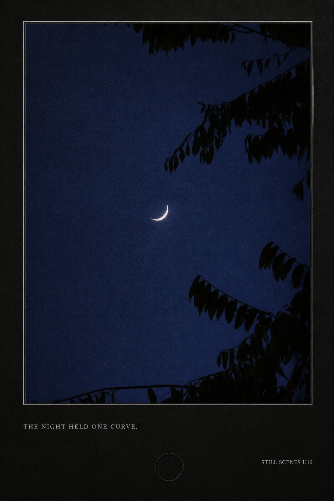

- Source: [`20250925_192842.jpg`](user-photo-styles/source-photos/20250925_192842.jpg)
- Output: [`demo-u16-moon-silver-gelatin.png`](user-photo-styles/generated/demo-u16-moon-silver-gelatin.png), 1024 × 1536

~~~text
Use case: image editing / silver-gelatin nocturne
Asset type: user-photo demo U16 for the Still Scenes Postcard Zine skill
Primary request: Transform the supplied crescent-moon photograph into a portrait 2:3 silver-gelatin nocturne postcard while preserving its quiet composition.
Reference handling: Use the supplied image as the only scene source. Preserve the tiny slim crescent low in the open sky and the irregular leaf silhouettes entering from the top and right. Keep the moon small and isolated; do not add stars, clouds, buildings, or a larger moon.
Composition: Flat black museum board with a vertically mounted photograph occupying 78% of the page. Use a broad lower mat and one fine silver keyline. Place a tiny embossed blind circle in the lower margin, with no other decoration.
Style/medium: Selenium-toned silver-gelatin print, deep velvety blacks, luminous crescent, soft analog grain, subtle darkroom edge.
Text (verbatim): "THE NIGHT HELD ONE CURVE."; "STILL SCENES U16".
Typography: First sentence exactly once in small silver-gray uppercase serif at lower left. Second exactly once in tiny uppercase sans at lower right. No other text.
Color palette: blue-black, silver gray, paper black, soft moon white.
Mood: nocturnal, precise, contemplative.
Constraints: recognizable crescent scale and leaf framing; exact readable text; no stars, people, logo, URL, date, location, watermark, or postal marks.
Avoid: astrophotography spectacle, galaxy, full moon, horror mood, glossy frame mockup, 3D depth, extra words, misspellings.
~~~

### U17 — Crescent moon / celestial field note

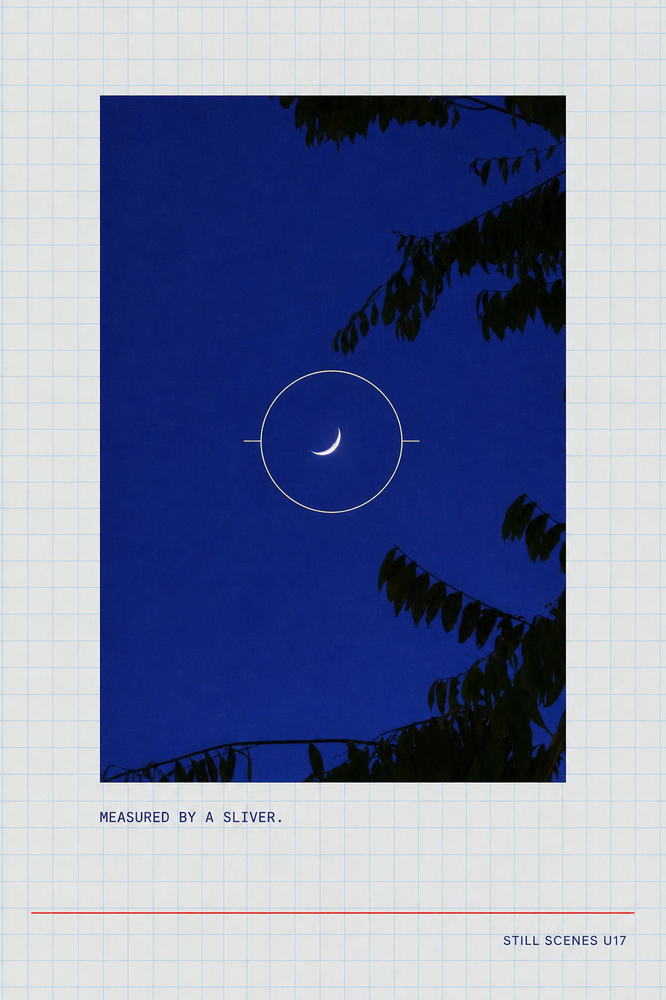

- Source: [`20250925_192842.jpg`](user-photo-styles/source-photos/20250925_192842.jpg)
- Output: [`demo-u17-moon-field-note.png`](user-photo-styles/generated/demo-u17-moon-field-note.png), 1024 × 1536

~~~text
Use case: image editing / celestial field-note layout
Asset type: user-photo demo U17 for the Still Scenes Postcard Zine skill
Primary request: Recompose the supplied crescent-moon photograph as a portrait 2:3 celestial field-note zine page without inventing astronomical content.
Reference handling: Use only the supplied photo. Preserve the small crescent, the empty cobalt-blue sky, and all leaf silhouettes at their approximate scale and edge positions. Do not add stars, constellations, coordinates, or a larger moon.
Composition: Flat pale-blue graph paper. Place the photo in a tall indigo rectangle covering the central 70%. Add one thin cream circle centered on the photographed crescent, two short unlabelled measurement ticks, and a narrow vermilion rule along the bottom. Leave generous margins.
Style/medium: Scientific field notebook interpreted as minimal editorial design, offset ink, faint grid, matte paper, disciplined marks.
Text (verbatim): "MEASURED BY A SLIVER."; "STILL SCENES U17".
Typography: First sentence exactly once in dark indigo uppercase mono below the image at left. Second exactly once in tiny uppercase sans at lower right. No other letters or numbers.
Color palette: pale blue, cobalt, indigo, cream, one vermilion rule.
Mood: attentive, curious, quiet.
Constraints: crescent and leaf framing remain recognizable; exact readable text; no fake data, stars, logos, URL, date, location, watermark, or postal marks.
Avoid: astronomy chart labels, constellation lines, sci-fi interface, multiple moons, glossy mockup, 3D shadow, extra text, misspellings.
~~~

### U18 — Hillside garden / woven jacquard

- Source: [`20250927_174531.jpg`](user-photo-styles/source-photos/20250927_174531.jpg)
- Output: [`demo-u18-garden-jacquard.png`](user-photo-styles/generated/demo-u18-garden-jacquard.png), 1536 × 1024

~~~text
Use case: image editing / woven textile interpretation
Asset type: user-photo demo U18 for the Still Scenes Postcard Zine skill
Primary request: Transform the supplied hillside garden photograph into a landscape 3:2 woven-textile scene postcard while retaining the real landscape structure.
Reference handling: Use the supplied image as the sole scene source. Preserve the large shaded tree at left, tall narrow conifers, blue sky and clouds, layered hillside, paths and fences, architecture glimpses, and small red foliage accents. Do not replace the garden with a generic forest.
Composition: Flat warm flax-paper card. A large rectangular woven image occupies 84% of the surface with a narrow cream selvedge. Use a simple caption strip underneath and one short red stitched bar; no decorative border pattern.
Style/medium: Fine jacquard tapestry translated from photography, visible interlaced threads, controlled tonal weaving, matte natural fibers, contemporary textile sample.
Text (verbatim): "THE HILLSIDE WOVE ITSELF."; "STILL SCENES U18".
Typography: First sentence exactly once in dark forest-green uppercase serif at bottom left. Second exactly once in tiny uppercase sans at bottom right. No other text.
Color palette: moss, pine, fern, sky blue, flax, small woven red accents.
Mood: dense, tactile, sheltered.
Constraints: source depth, trees, structures, and color anchors remain recognizable; exact text; no people, fantasy animals, logo, URL, date, location, watermark, or postal marks.
Avoid: decorative folk motifs, carpet border, generic jungle, resort imagery, glossy mockup, 3D folded fabric, extra words, misspellings.
~~~

### U19 — Hillside garden / topographic map fold

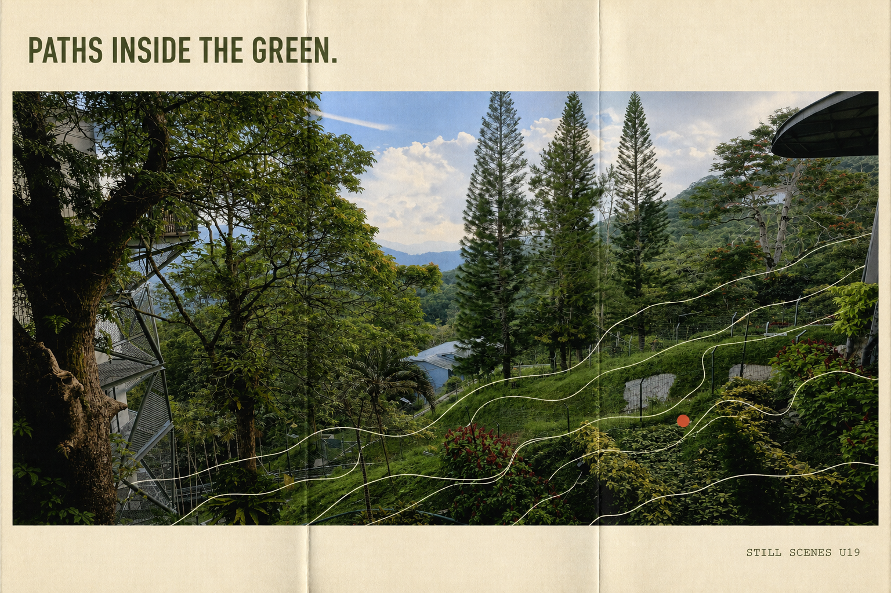

- Source: [`20250927_174531.jpg`](user-photo-styles/source-photos/20250927_174531.jpg)
- Output: [`demo-u19-garden-mapfold.png`](user-photo-styles/generated/demo-u19-garden-mapfold.png), 1536 × 1024

~~~text
Use case: image editing / topographic map-fold collage
Asset type: user-photo demo U19 for the Still Scenes Postcard Zine skill
Primary request: Recompose the supplied hillside garden photograph as a landscape 3:2 topographic map-fold postcard while keeping the source scene recognizable.
Reference handling: Use only the supplied photograph. Preserve the shaded left tree, tall conifers, layered green slope, blue sky, paths, fences, buildings, and red foliage accents. Do not invent geographic names, contour elevations, or new terrain.
Composition: Flat pale-cream paper with three subtle vertical fold lines. Place the source photo across the full central band. Overlay four thin unlabeled contour-like lines that follow the visible slope, plus one small vermilion path marker. Keep a clean header and footer.
Style/medium: Contemporary walking-map editorial collage, matte offset photo, translucent contour ink, tactile folded paper, restrained utility design.
Text (verbatim): "PATHS INSIDE THE GREEN."; "STILL SCENES U19".
Typography: First sentence exactly once in dark olive uppercase sans at upper left. Second exactly once in tiny uppercase mono at lower right. No other words, labels, coordinates, or numbers.
Color palette: cream, olive, forest green, sky blue, graphite, one vermilion marker.
Mood: exploratory, layered, grounded.
Constraints: source garden and its man-made paths/structures remain identifiable; exact readable text; no fake map data, people, logos, URL, date, location, watermark, or postal marks.
Avoid: tourist map, location pins with labels, fantasy terrain, dense contour clutter, glossy mockup, 3D folded perspective, extra text, misspellings.
~~~

### U20 — Blue house / photographic blueprint

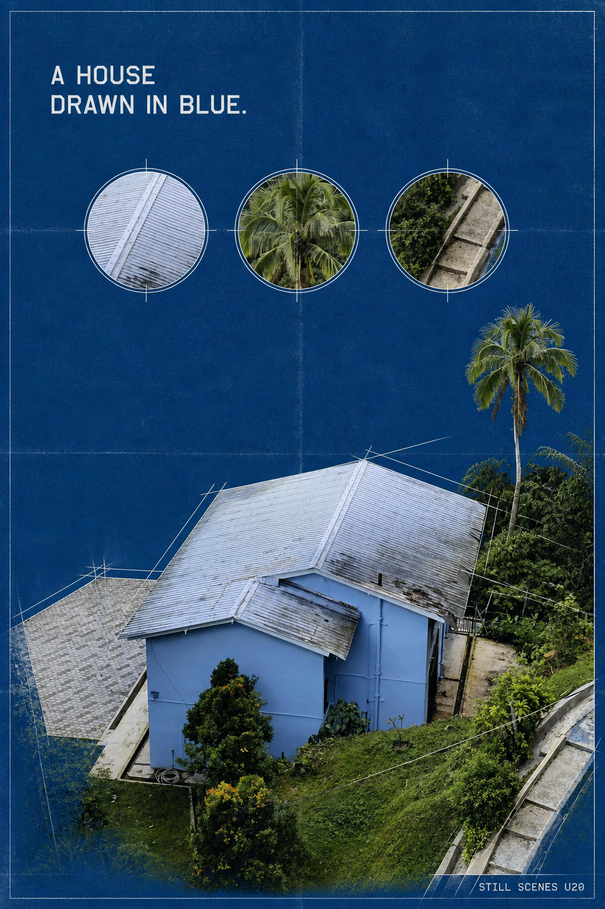

- Source: [`20250927_175045.jpg`](user-photo-styles/source-photos/20250927_175045.jpg)
- Output: [`demo-u20-house-blueprint.png`](user-photo-styles/generated/demo-u20-house-blueprint.png), 1024 × 1536

~~~text
Use case: image editing / architectural blueprint hybrid
Asset type: user-photo demo U20 for the Still Scenes Postcard Zine skill
Primary request: Transform the supplied blue hillside-house photograph into a portrait 2:3 photographic blueprint postcard.
Reference handling: Use the supplied photo as the only architectural source. Preserve the pale-blue house, silver pitched roof, right-edge stairs, surrounding forest, tall palm, slope, and elevated viewpoint. Keep the real building geometry; do not invent rooms, windows, or dimensions.
Composition: Flat deep blueprint-blue paper. Place one high-contrast photographic cutout of the actual house and slope in the lower 58%. Extend only the roof edges and stair direction with thin white drafting lines. Add three small unlabeled circular detail crops from the source—roof texture, palm fronds, and stair edge—along the top.
Style/medium: Cyan blueprint, photographic emulsion, white technical pencil, subtle fold wear, modern architectural archive.
Text (verbatim): "A HOUSE DRAWN IN BLUE."; "STILL SCENES U20".
Typography: First sentence exactly once in white uppercase geometric sans at upper left. Second exactly once in tiny uppercase mono at lower right. No other text, dimensions, or numbers.
Color palette: blueprint blue, cyan, paper white, source pale blue, small forest-green remnants.
Mood: precise, sheltered, quietly analytical.
Constraints: house geometry and viewpoint remain recognizable; exact readable text; no fake plan labels, people, logo, URL, date, location, watermark, or postal marks.
Avoid: floor plan invention, measurements, luxury real-estate styling, glowing neon, 3D render, extra text, misspellings.
~~~

### U21 — Blue house / colored-pencil diary

- Source: [`20250927_175045.jpg`](user-photo-styles/source-photos/20250927_175045.jpg)
- Output: [`demo-u21-house-colored-pencil.png`](user-photo-styles/generated/demo-u21-house-colored-pencil.png), 1024 × 1536

~~~text
Use case: image editing / colored-pencil architectural diary
Asset type: user-photo demo U21 for the Still Scenes Postcard Zine skill
Primary request: Reinterpret the supplied blue hillside-house photograph as a portrait 2:3 colored-pencil diary postcard while faithfully retaining the place.
Reference handling: Use only the supplied image. Preserve the pale-blue building, weathered silver roof, steps on the right, dark forest layers, tall palm, cables, garden slope, and elevated camera angle. Keep proportions recognizable and avoid adding people or new architecture.
Composition: Flat warm sketchbook paper. The illustrated scene fills the lower 75%, with soft irregular pencil edges fading into the page. Leave an open upper-left sky-shaped paper area for caption and add one small cobalt pencil swatch at the bottom.
Style/medium: Layered artist-grade colored pencil with graphite underdrawing, visible hatch marks, soft paper tooth, intimate location sketch rather than children's illustration.
Text (verbatim): "SHELTER UNDER A GREEN HORIZON."; "STILL SCENES U21".
Typography: First sentence exactly once in dark graphite italic serif in the open upper-left area. Second exactly once in tiny uppercase sans at the bottom right. No handwriting or other text.
Color palette: pale house blue, silver gray, layered forest greens, warm paper, cobalt accent.
Mood: personal, sheltered, gently observed.
Constraints: recognizable source house, roof, stairs, palm, and viewpoint; exact text; no people, cars, fantasy details, logo, URL, date, location, watermark, or postal marks.
Avoid: children's-book cartoon, generic cabin, luxury property rendering, glossy mockup, hard 3D shadow, extra words, misspellings.
~~~

### U22 — Cloud tower / monochrome lithograph

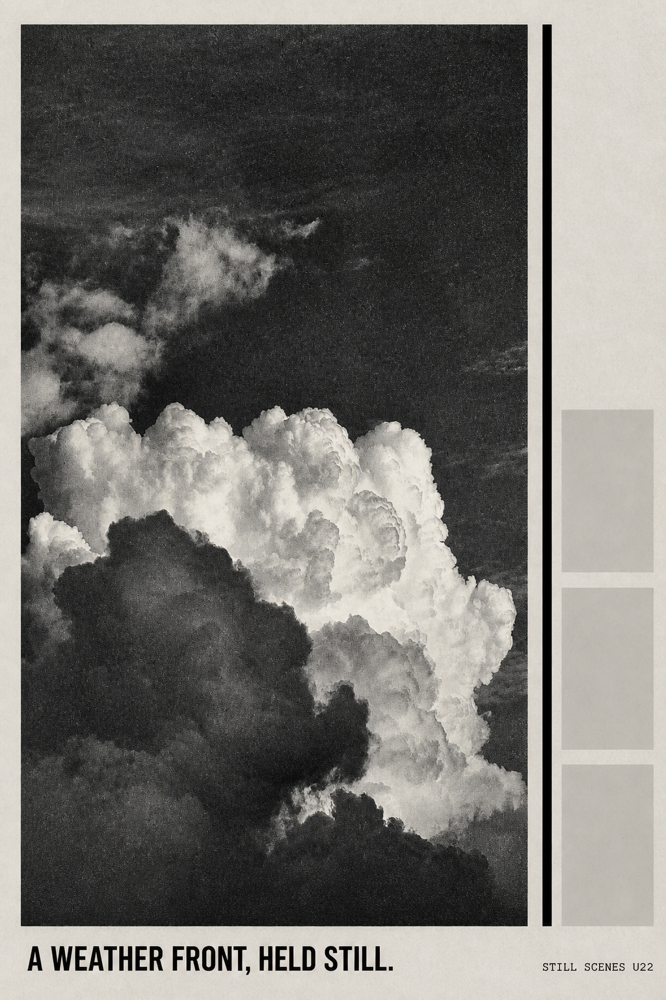

- Source: [`20250927_182437.jpg`](user-photo-styles/source-photos/20250927_182437.jpg)
- Output: [`demo-u22-cloud-lithograph.png`](user-photo-styles/generated/demo-u22-cloud-lithograph.png), 1024 × 1536

~~~text
Use case: image editing / black-and-white lithographic broadsheet
Asset type: user-photo demo U22 for the Still Scenes Postcard Zine skill
Primary request: Transform the supplied towering-cloud photograph into a portrait 2:3 monochrome lithographic scene postcard.
Reference handling: Use the supplied photo as the only cloud source. Preserve the large sunlit cumulus rising from the bottom, deep open upper sky, darker foreground cloud, and actual cloud contours. Do not add architecture, aircraft, birds, or fantasy shapes.
Composition: Flat soft-gray paper. A tall black-and-white image occupies the left 80% with a broad white border. On the narrow right rail place one solid black vertical rule and three blank gray squares. Caption sits in the deep bottom margin.
Style/medium: Stone lithography and newspaper photo engraving, rich charcoal blacks, granular sky, expressive but faithful cloud modeling, matte paper.
Text (verbatim): "A WEATHER FRONT, HELD STILL."; "STILL SCENES U22".
Typography: First sentence exactly once in bold black uppercase grotesk at bottom left. Second exactly once in tiny uppercase mono at bottom right. No other text.
Color palette: paper gray, charcoal, black, cloud white.
Mood: monumental, factual, still.
Constraints: recognizable supplied cloud silhouette and negative-space sky; exact readable text; no people, logos, URL, date, location, watermark, or postal marks.
Avoid: storm-disaster headline, literal building, fantasy creature, color accents, glossy mockup, 3D frame, extra words, misspellings.
~~~

### U23 — Cloud tower / embossed paper relief

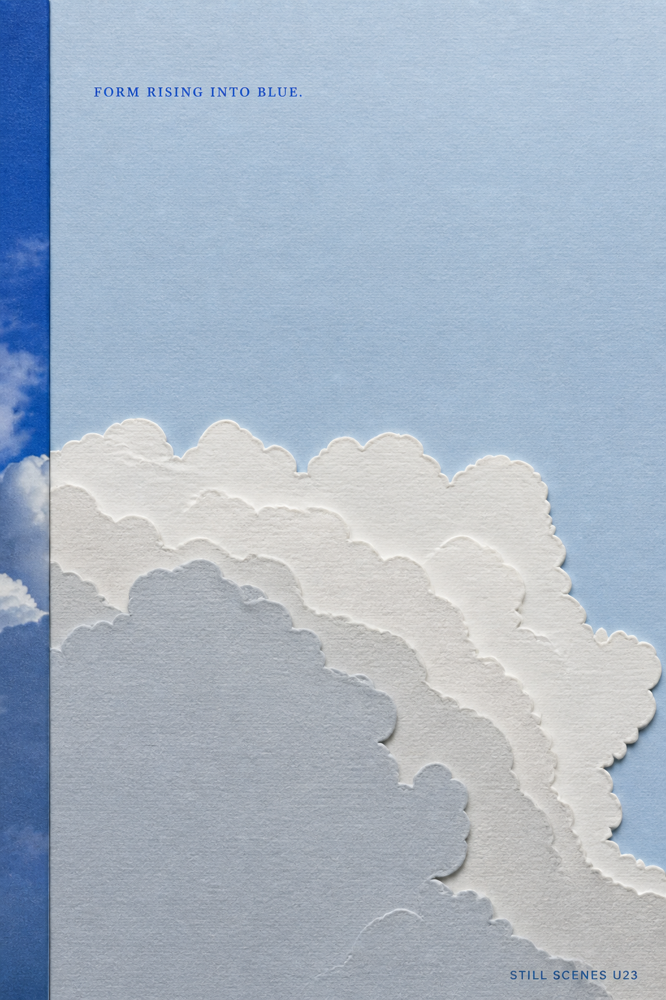

- Source: [`20250927_182437.jpg`](user-photo-styles/source-photos/20250927_182437.jpg)
- Output: [`demo-u23-cloud-paper-relief.png`](user-photo-styles/generated/demo-u23-cloud-paper-relief.png), 1024 × 1536

~~~text
Use case: image editing / embossed paper relief
Asset type: user-photo demo U23 for the Still Scenes Postcard Zine skill
Primary request: Reinterpret the supplied cloud photograph as a portrait 2:3 paper-relief scene-zine page while preserving the source cloud's contours and scale.
Reference handling: Use only the supplied image. Preserve the towering bright cloud in the lower half, open upper blue field, and darker foreground cloud. Translate the real edges into layered paper shapes without inventing new clouds, objects, or scenery.
Composition: Flat pale sky-blue board. Build the main cloud from five nested white and cool-gray cut-paper relief layers in the lower 62%, following the source silhouette. Leave the upper field nearly empty. Add one thin cobalt photo strip along the left edge showing a narrow crop of the original cloud.
Style/medium: Hand-cut cotton paper relief photographed front-on, subtle emboss, shallow natural shadows, museum-book restraint rather than a 3D mockup.
Text (verbatim): "FORM RISING INTO BLUE."; "STILL SCENES U23".
Typography: First sentence exactly once in small cobalt uppercase serif at upper left. Second exactly once in tiny uppercase sans at lower right. No other readable text.
Color palette: sky blue, paper white, cool gray, cobalt.
Mood: sculptural, airy, contemplative.
Constraints: paper layers must track the supplied cloud silhouette; exact text; no architecture, people, birds, logos, URL, date, location, watermark, or postal marks.
Avoid: cartoon cloud icons, pop-up book perspective, fantasy castle, heavy drop shadows, glossy mockup, extra text, misspellings.
~~~

### U24 — Cloud and bird / four-ink screenprint

- Source: [`20250927_182447.jpg`](user-photo-styles/source-photos/20250927_182447.jpg)
- Output: [`demo-u24-cloud-screenprint.png`](user-photo-styles/generated/demo-u24-cloud-screenprint.png), 1024 × 1536
- QA note: the initial render hid the tiny bird; the exact prompt below is the successful retry used for the final artifact.

~~~text
Use case: image editing / limited-color screenprint
Asset type: user-photo demo U24 for the Still Scenes Postcard Zine skill
Primary request: Transform the supplied vertical cloud-and-bird photograph into a portrait 2:3 limited-color screenprint postcard.
Reference handling: Use the supplied photo as the sole source. Preserve the bright cumulus mass low in frame, dark foreground cloud, wide blue upper sky, and the source's ONE tiny bird at right. The final print MUST contain exactly one clearly visible but still small charcoal bird silhouette in the mid-right open sky, matching the source position. Do not add any other bird or scenery.
Composition: Flat cream stock. One large vertical image block fills 84% of the card. Separate the source into four screenprint passes—deep blue sky, pale blue shadow, warm white cloud, charcoal bird/foreground—with a narrow coral footer rule.
Style/medium: Four-ink screenprint, coarse halftone, subtle misregistration, dry matte ink, contemporary print-studio finish.
Text (verbatim): "BLUE ABOVE, WHITE BELOW."; "STILL SCENES U24".
Typography: First sentence exactly once in deep-blue uppercase sans at bottom left. Second exactly once in tiny uppercase mono at bottom right. No other text.
Color palette: deep blue, pale blue, warm white, charcoal, one coral rule.
Mood: bold, open, upward.
Constraints: recognizable source cloud and open sky; exactly one visible tiny charcoal bird at mid-right; exact readable text; no people, aircraft, logos, URL, date, location, watermark, or postal marks.
Avoid: missing bird, multiple birds, pop-art comic text, fantasy forms, glossy mockup, 3D shadow, extra words, misspellings.
~~~

### U25 — Cloud and bird / dry pastel

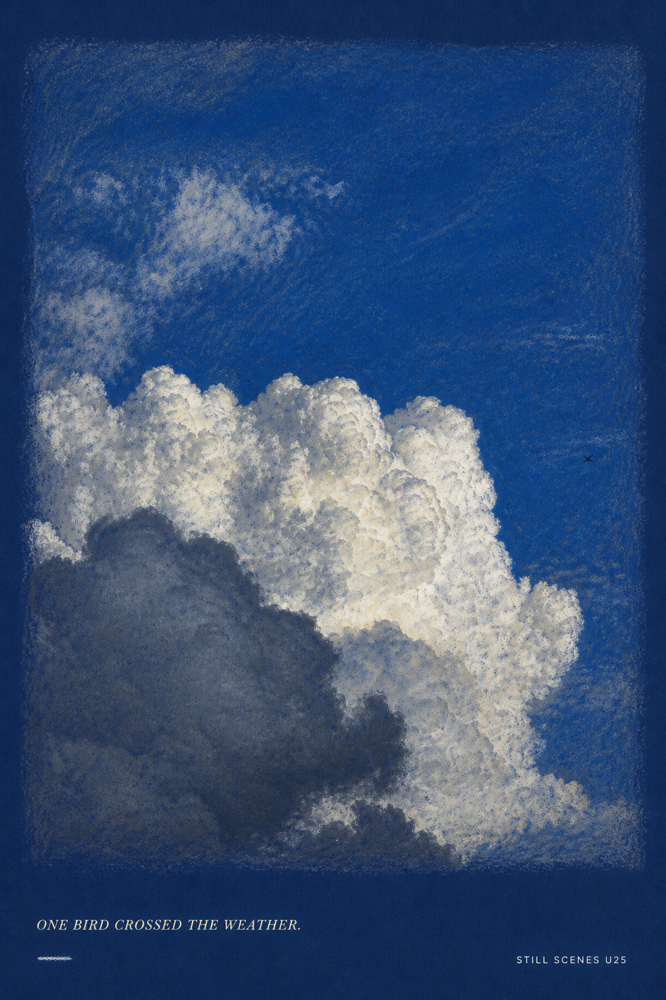

- Source: [`20250927_182447.jpg`](user-photo-styles/source-photos/20250927_182447.jpg)
- Output: [`demo-u25-cloud-pastel.png`](user-photo-styles/generated/demo-u25-cloud-pastel.png), 1024 × 1536

~~~text
Use case: image editing / dry-pastel sky study
Asset type: user-photo demo U25 for the Still Scenes Postcard Zine skill
Primary request: Transform the supplied vertical cloud-and-bird photograph into a portrait 2:3 dry-pastel scene postcard.
Reference handling: Use the supplied image as the only scene source. Preserve the towering white cumulus in the lower half, darker foreground cloud, broad deep-blue upper sky, and exactly one tiny bird at right. Follow the real cloud shapes and scale rather than inventing a new sky.
Composition: Flat deep-blue pastel paper. The drawing fills 82% of the card with loose powdery edges. Leave a quiet lower margin and add one small white chalk dash. Ensure the single bird remains a crisp dark mark against the open sky.
Style/medium: Artist-grade soft and dry pastel, layered scumbling, visible paper tooth, luminous whites, restrained hand-worked texture.
Text (verbatim): "ONE BIRD CROSSED THE WEATHER."; "STILL SCENES U25".
Typography: First sentence exactly once in small warm-white italic serif at bottom left. Second exactly once in tiny uppercase sans at bottom right. No other text.
Color palette: ultramarine paper, white, pale blue, charcoal, faint warm gray.
Mood: airy, fleeting, quietly observed.
Constraints: recognizable source cloud and exactly one visible tiny bird at right; exact readable text; no people, aircraft, extra birds, logos, URL, date, location, watermark, or postal marks.
Avoid: chalkboard lettering, cartoon clouds, fantasy sky, glossy mockup, 3D frame, extra words, misspellings.
~~~

### U26 — Orange cloud / stained glass

- Source: [`20250927_190614.jpg`](user-photo-styles/source-photos/20250927_190614.jpg)
- Output: [`demo-u26-cloud-stained-glass.png`](user-photo-styles/generated/demo-u26-cloud-stained-glass.png), 1536 × 1024

~~~text
Use case: image editing / stained-glass interpretation
Asset type: user-photo demo U26 for the Still Scenes Postcard Zine skill
Primary request: Transform the supplied orange-lit cloud photograph into a landscape 3:2 stained-glass scene postcard while preserving the real cloud mass.
Reference handling: Use only the supplied photo. Preserve the central billowing cloud glowing orange, darker surrounding cloud layers, low shadowed base, and source framing. Translate actual tonal boundaries into glass pieces without adding sun, landscape, figures, or symbols.
Composition: Flat front-facing warm-charcoal card. A broad rounded-rectangle glass panel fills 86% of the surface. Use fine dark lead lines that follow major cloud lobes and surrounding strata, with a narrow cream caption strip below.
Style/medium: Hand-cut translucent stained glass photographed straight-on, subtle material glow, fine leadwork, contemporary secular art panel.
Text (verbatim): "LIGHT GATHERED IN THE CLOUD."; "STILL SCENES U26".
Typography: First sentence exactly once in dark umber uppercase serif at lower left. Second exactly once in tiny uppercase sans at lower right. No other text.
Color palette: amber, burnt orange, smoke gray, charcoal, muted cream.
Mood: luminous, weighty, reverent without religious symbolism.
Constraints: recognizable source cloud silhouette and lighting; exact readable text; no crosses, religious icons, flames, explosions, people, logo, URL, date, location, watermark, or postal marks.
Avoid: church window motifs, kaleidoscope clutter, literal fire, disaster imagery, glossy product mockup, 3D room scene, extra words, misspellings.
~~~

### U27 — Orange cloud / encaustic photo transfer

- Source: [`20250927_190614.jpg`](user-photo-styles/source-photos/20250927_190614.jpg)
- Output: [`demo-u27-cloud-encaustic.png`](user-photo-styles/generated/demo-u27-cloud-encaustic.png), 1536 × 1024

~~~text
Use case: image editing / encaustic photo transfer
Asset type: user-photo demo U27 for the Still Scenes Postcard Zine skill
Primary request: Reinterpret the supplied orange-lit cloud photograph as a landscape 3:2 encaustic-wax photo-transfer postcard.
Reference handling: Use the supplied photo as the sole scene source. Preserve the large central cloud illuminated warm orange, surrounding slate-gray layers, dark lower cloud bank, and real composition. Keep the image recognizable beneath the wax; do not invent landscape or objects.
Composition: Flat raw-linen card. Place one wide photographic transfer occupying 88% of the card, with softly irregular wax edges and a narrow uncoated linen footer. Add one small horizontal ember-orange wax bar beside the caption.
Style/medium: Translucent beeswax encaustic over matte photographic transfer, layered scraping, subtle cloudy bloom, fine linen texture, no heavy impasto.
Text (verbatim): "EMBER WEATHER, GOING DARK."; "STILL SCENES U27".
Typography: First sentence exactly once in charcoal italic serif at bottom left. Second exactly once in tiny uppercase sans at bottom right. No other readable text.
Color palette: smoke gray, warm amber, ember orange, charcoal, raw linen.
Mood: fading, tactile, warm beneath darkness.
Constraints: source cloud shape and light remain identifiable; exact readable text; no flames, explosion, sun, people, birds, logos, URL, date, location, watermark, or postal marks.
Avoid: abstract wax-only canvas, disaster imagery, fantasy cloud, glossy mockup, 3D wall display, extra text, misspellings.
~~~

## Reuse notes

- U10–U27 were produced from reduced review copies of the preserved camera originals because the full-resolution JPEG payloads exceeded the image service input limit.
- Replace the scene-specific invariants whenever a treatment is reused with another photo.
- Keep `Text (verbatim)` locked and compare it character-for-character after generation.
- Treat a visible person, pet, product, artwork, or private location as a higher-preservation case than the landscape examples in this set.
- Keep the source photo attached through the runtime reference mechanism; a textual description is not a substitute for a personal edit target.
